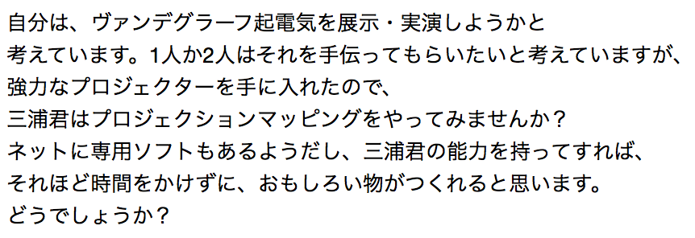
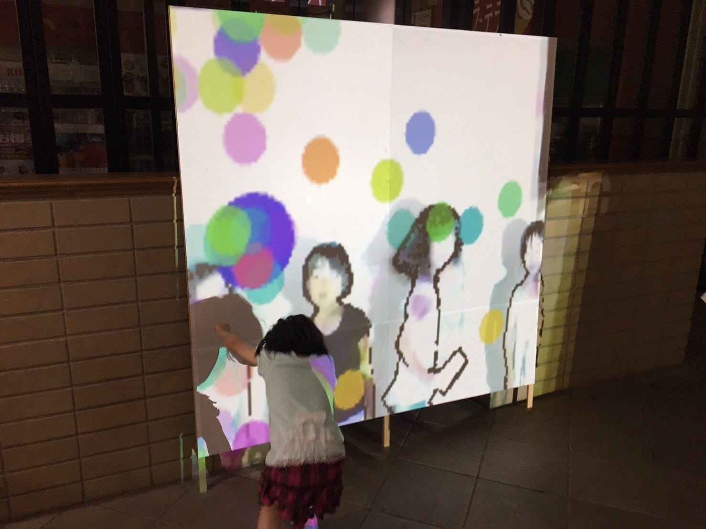

> 本記事は 2017年7月22日に [Medium](https://medium.com/@ryoppippi/%E5%BD%B1%E3%81%AE%E3%82%AD%E3%83%A3%E3%83%B3%E3%83%90%E3%82%B9-silhouette-on-canvas-52284efb38de) へ公開したものを、このブログへ移したものです。

７月１７日（月）、ICUキッズカレッジにて展示しました。

<!-- https://www.youtube.com/watch?v=MngEJwk5KPU -->
<YouTube youTubeId="MngEJwk5KPU" />

> キャンバスの前に立つと、現れるのはラフな輪郭で描かれたデジタルな「影」
>
> 近づいてみると、ぱあっと広がるのは万華鏡のように色彩豊かな「影」
>
> プロジェクタが作り出す、暗く力強いアナログな「影」
>
> 時折影は止まり、キャンバスの上にできあがるのはデジタル、アナログ、そしてカラフルな「影」が織りなす一つの「絵画」
>
> そんな不思議な絵画が、生まれては消えてゆく

海の日にICUで毎年行われている「キッズカレッジ」というイベントがある。これは生物と物理の教授たちが中心となって開催している小・中学生対象の科学実験教室である。

僕は物理の岡村教授が主催してる「ICUサイエンスクラブ」の一員として去年から参加していて、ちょうど一年前はポンポン船製作体験なんてことをやっていた（ポニョとそうすけが乗っていた、あの船である）。

６月頃、今年は何を出そうかしらとぼんやり考えていたある日、教授から強力なプロジェクタを買ったとのメールが届いた。

プロジェクタを使って何かを作ったことはなかったが、少メディアアート（と言ったら怒られるかもしれないが）の作品を作ってみたいなと思っていたこともあり、ワクワクしながらラボへと向かった。

試しに電源を入れてみると、これがなかなか強力な代物である。ここまで広範囲を明るく照らせるものはICUでは珍しいな、と心が踊った

さて時は流れ７月１３日。本番まで時間も僅かな中で、何もできていない状況にかなり焦っていた。この頃から理学館に籠るようになり、アイデアを出して実験しては行き詰まる、ということを繰り返していた。

１４日には急遽Kinect（Microsoftが開発しているモーションキャプチャのセンサー）を土壇場で購入してみるものの、完全に行き詰まっていた(当初Leap Motionを使う予定であったが、認識できる動きが小さく、また子供たちを機会から遠ざけたいとの判断から無しになった)。

そして、前日のリハーサルも終わりに差し掛かった頃、一旦描画を停止してコードを見直していると、後輩からスクリーンを見てくださいとの声が。ふと顔を上げて見るとそこには、

そこには綺麗な、なんとも雰囲気のある「絵画」が浮かんでいたのである。

これだ！ ということになり、早速ラボに戻って実装、調整が始まった。

発想の逆転といえば大袈裟だろうが、今まで動きのあるものを作ろうとしていた自分にとって、スクリーンをキャンバスに見立てて静止画を作るというのは考えもつかないものであった。

こういう時にProcessingは便利である。プロトタイプを素早く作って試すことができるからだ。カラフルな「影」の実装では納得がいくまで何度も修正と実験を繰り返した。

夜が更け、朝が来て、なんとか開場時間ギリギリで完成させることができた。

事前テストなどほとんどできずに本番を迎えたが、当日は子どもたちを含め多くの人たちに遊んでもらい、たくさんの素晴らしい「絵画」も生まれた。また自分の作品を人の前で見てもらう機会もそう多くないので、今回のイベントは貴重な経験となった。

<!-- https://twitter.com/icu_science/status/888045891658973185 -->
<Tweet id="888045891658973185" />

最後にご来場された皆様、インスピレーションを与えてくれた後輩、そしてこういった機会をくださった岡村教授に感謝をして、この記事を終えようと思う。

