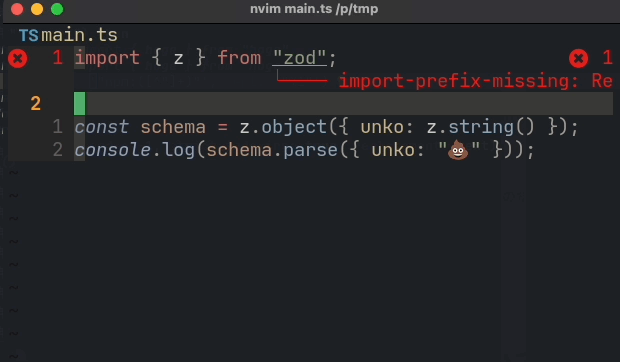
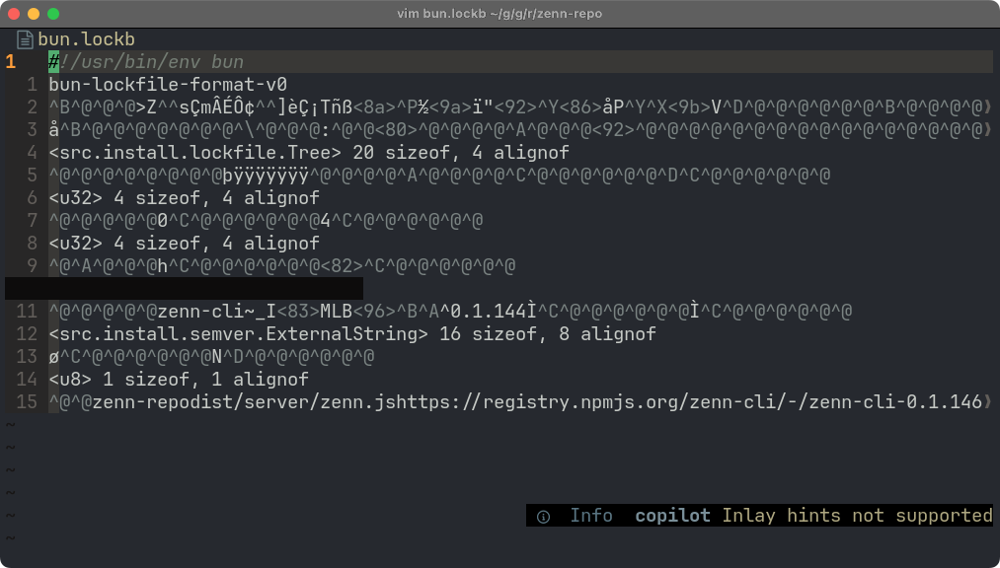
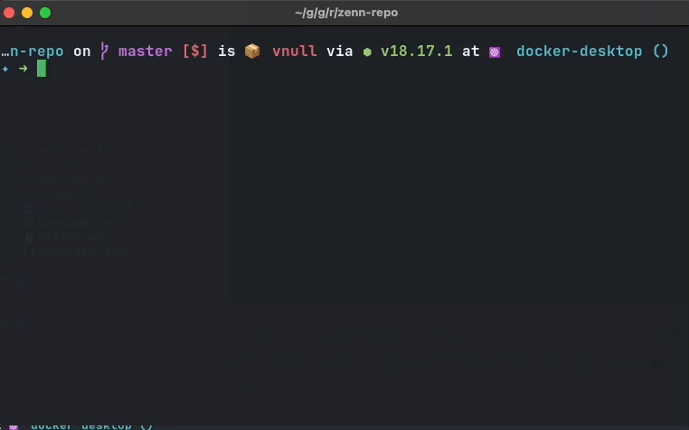

> [!NOTE]
> この記事は[Vim 駅伝](https://vim-jp.org/ekiden/)の 9/27 の記事です。

# はじめに

[Bun](https://bun.sh/)の1.0が発表されましたね！
自分はすでにいくつかのプロジェクトに導入したりして、とても気に入っています。

https://github.com/ryoppippi/str-fns

例えばこちらの自作プロジェクトでは、 node18 + pnpm + vitestからbunに移行したところ:

- Packageのインストールが8秒から0.5秒に
- vitestからbun testへの移行で5秒から0.3秒に
- tscによる型チェックが2.5秒から1秒に

と、とても高速になりました。

またモノレポにも対応しているので、手元のプロジェクトたちを順次pnpmからbunに移行しています。

# BunでペライチのCLI Toolを書く

さて、BunにはAuto Installという機能があります。

https://bun.sh/docs/runtime/autoimport

これはスクリプトの先頭にあるimport文を解析し、必要なパッケージを自動でインストールしてくれる機能です。

例えば

```ts
import { z } from 'zod';

const schema = z.object({ unko: z.string() });
console.log(schema.parse({ unko: '💩' }));
```

```sh
➜ bun run main.ts
{
  unko: "💩"
}
```

のように、自動的にzodをfetchし実行してくれます。
`node_module`を作る必要がないので、気楽に実行できますね。

また先頭にシェバンを書くことで、`./main.ts`のように実行することもできます。

```ts
#!/usr/bin/env bun
import { z } from 'zod';

const schema = z.object({ unko: z.string() });
console.log(schema.parse({ unko: '💩' }));
```

```sh
➜ chmod +x main.ts
➜ ./main.ts
{
  unko: "💩"
}
```

## Neovim + Deno LSPでBun+ペライチのCLI Toolを書く

さて、BunでCLI Toolを書くとき、問題となるのはLSPがないことです。
現状ではBunのLSPはなく、TSServerを使わないといけません。
しかしTSServerでライブラリの情報を補完するには`node_modules`がないといけません。
つまり、ペライチで `nvim main.ts` とかやると、補完が効かなくて悲しい気持ちになります。
困りましたね。

...ここで[Deno](https://deno.com)の出番です！
Denoには組み込みのLSPがあり、`node_modules`がなくてもライブラリの情報を補完してくれます。
これをうまく使えば、BunでペライチのCLI Toolを書くことができるでしょう！

## Denoの`import`とBunの`import`を行き来する

Denoでnpmのライブラリを使うときは、`import`のパスに`npm:`プレフィックスをつけます。
逆にいえば、Deno LSPは`npm:`がついていない`import`のことは、npmのライブラリとして認識してくれません。

```sh
import { z } from 'npm:zod'

const schema = z.object({ unko: z.string() })
console.log(schema.parse({ unko: '💩' }))
```

ということで、Bunの`import`をDenoの`import`に変換する関数をLuaで書いてみましょう！

```lua
vim.api.nvim_create_user_command("BunToDeno", function()
    -- get current buffer text
    local text = vim.api.nvim_buf_get_lines(0, 0, -1, true)
    -- loop by lines
    for i, line in ipairs(text) do
        -- if the line stats with `import`
        if string.match(line, "^import") then
            -- import { hoge } from "hoge" => import { hoge } from "npm:hoge"
            -- import { hoge } from 'hoge' => import { hoge } from 'npm:hoge'
            text[i] = string.gsub(line, '"([^"]+)"', '"npm:%1"')
        end
    end
    -- set replaced text to current buffer
    vim.api.nvim_buf_set_lines(0, 0, -1, true, text)
end, {})

vim.api.nvim_create_user_command("DenoToBun", function()
    -- get current buffer text
    local text = vim.api.nvim_buf_get_lines(0, 0, -1, true)
    -- loop by lines
    for i, line in ipairs(text) do
        -- if the line stats with `import`
        if string.match(line, "^import") then
            -- import { hoge } from "npm:hoge" => import { hoge } from "hoge"
            -- import { hoge } from 'npm:hoge' => import { hoge } from 'hoge'
            text[i] = string.gsub(line, '"npm:([^"]+)"', '"%1"')
        end
    end
    -- set replaced text to current buffer
    vim.api.nvim_buf_set_lines(0, 0, -1, true, text)
end, {})
```

こうすることでcommand一発でBunとDenoのimportを行き来できます!
便利ですね！



<details>
<summary>ちなみに: Neovim以外をお使いの方のために</summary>

TSで実装したCLIを置いておきます。
Denoが入っている環境で動きます。
https://github.com/ryoppippi/toDeno-toBun

</details>

<details>
<summary>ちなみに: Denoでよくない？</summary>

ここまで読んで、「素直にDenoで書けばいいじゃん」と思った方もいるかもしれません。

```ts
#!/usr/bin/env deno run -A
import { z } from 'npm:zod';

const schema = z.object({ unko: z.string() });
console.log(schema.parse({ unko: '💩' }));
```

これで全然動きますし、LSPも使えるし、現状色々安定してるしDenoの方が良さげな気もします。
ただし、使いたいライブラリ(主にnpmに転がっているもの)によっては、Denoで動かず、Bunでは動く、ということがあります。
[cleye](https://github.com/privatenumber/cleye)はその一例です（まあDenoには[cliffy](https://deno.land/x/cliffy@v1.0.0-rc.3)がありますが)

自分もDenoを毎日使っていますし、Denoの方が安定しているとは思いますが、場合によっては上記の理由によるBunが適している場合もあるため、どちらも使えるようにしておくと幸せになれるかなと考えています。

</details>

# bun.lockbの中身をNeovimで確認する

Bunには`bun.lockb`というLockfileがあります(`package-lock.json`のようなもの)。
これは`bun install`を実行すると自動で生成されます。

このlockfileのおかげで依存関係の解決が高速になります。
しかし、バイナリファイルであるため、中身を見ることができません。
これはちょっと不便ですね。


実はbunにはlockfileをyarn v1形式で出力する機能があります。

https://bun.sh/docs/install/lockfile

これを使うと、lockfileの中身が読めるようになります。

```sh
bun bun.lockb
```

さて、この機能を使って、Neovimでlockfileを開いたら自動でyarnのlockfileに変換するようにしてみましょう。

```lua
vim.api.nvim_create_autocmd("BufReadCmd", {
    pattern = "bun.lockb",
    callback = function(ev)
        -- get the absolute path of the current file
        local path = vim.fn.expand("%:p")
        -- run command 'bun ' .. path and get stdout
        local output = vim.fn.systemlist("bun " .. path)
        -- set output to current buffer
        vim.api.nvim_buf_set_lines(0, 0, -1, true, output)
        -- set filetype to yarn.lock
        vim.opt_local.filetype = "conf"
        -- set readonly
        vim.opt_local.readonly = true
        -- set nomodifiable
        vim.opt_local.modifiable = false
    end,
})
```

これで、`bun.lockb`を開くと、自動でyarnのlockfileを生成し、一時的なBufferとして表示してくれます！



(ちなみに、VSCodeをお使いの方は、[Bun for Visual Studio Code](https://marketplace.visualstudio.com/items?itemName=oven.bun-vscode)を導入すると自動でlockfileがyarn形式に変換され表示されます。ただし表示がまあまあ遅いです。Neovimだと本当に一瞬で出てきますが...)

# まとめ

楽しいBun Lifeを！
