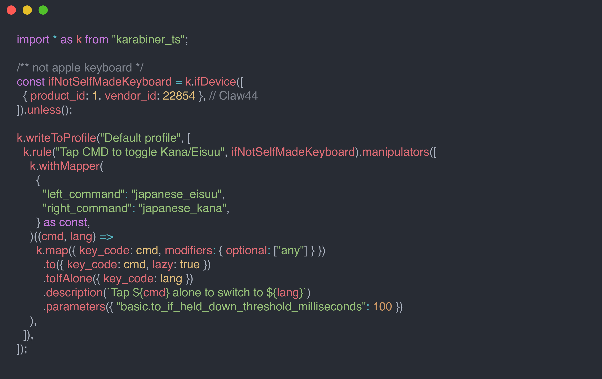

# TL;DR

karabiner.tsがとてもいいぞ



https://evan-liu.github.io/karabiner.ts/

# はじめに

macOSユーザーの皆様におかれましては、キーボードのカスタマイズツールとして有名なKarabiner-Elementsをご存知かと思います。

https://karabiner-elements.pqrs.org/

Karabiner-Elementsは、macOSのキーボードイベントをフックして、キーの入力をカスタマイズすることができるツールです。

中でも Complex Rules という機能を使うと、かなり自由度の高いカスタマイズが可能です。
例えば、

- CapsLockをCtrlに変更する
- Commandを空打ちで英/かなを切り替える
- アプリを起動するショートカットを追加する

など、様々なカスタマイズが可能です。

https://karabiner-elements.pqrs.org/docs/manual/configuration/configure-complex-modifications/

自分も初めてMacを手にした時からKarabiner-Elementsを使っていて、結構カスタマイズしています。

しかし、Karabiner-Elementsの設定ファイルはJSON形式で記述するため、設定が複雑になると管理が大変になります。
自分もまあまあな量の設定をしているのですが、JSONなので冗長ですし、繰り返しの設定を書くのが面倒です。
可読性も悪いです。

何かいい方法はないかと探していたところ、karabiner.tsというツールを見つけました。

# karabinerの設定をいい感じに書く

karabinerの設定をいい感じに書くための試みはいくつかなされています。

JSON Schemaを使って補完を聞かせる方法や、
https://github.com/pqrs-org/Karabiner-Elements/issues/1918

Edn形式で設定を書く方法などがあります。
https://github.com/yqrashawn/GokuRakuJoudo

またTypeScriptを使って設定を書く方法もあります。
https://github.com/mxstbr/karabiner
https://github.com/evan-liu/karabiner.ts

色々試した結果、karabiner.tsが一番自分に合っていると感じました。

# karabiner.ts

karabiner.tsは、TypeScriptを使ってkarabinerの設定を書くためのツールです。
karabiner.tsを使うと、TypeScriptの型システムを使ってkarabinerの設定を書くことができます。
そのため、キーの名前に補完が効いたり、型エラーが出たりするので、設定を書く際にとても便利です。
もちろんTypeScriptの構文が使えるので、mapやfilterなどの関数を使って設定を書くこともできます。
APIがだいぶ関数型を意識して設計されているので、とても書きやすかったです。

例えば、CapsLockをCtrlに変更する設定は以下のように書くことができます。

```typescript
import * as k from 'karabiner_ts';

k.rule('Change CapsLock to Ctrl')
	.manipulators([
		k.map({ key_code: 'caps_lock' })
			.to({ key_code: 'left_control' })
			.toIfAlone({ key_code: 'caps_lock' }),
	]);
```

これがコンパイルされると、以下のようなJSONが生成されます。

```json
{
	"description": "Change CapsLock to Ctrl",
	"manipulators": [
		{
			"type": "basic",
			"from": {
				"key_code": "caps_lock"
			},
			"to": [
				{
					"key_code": "left_control"
				}
			],
			"to_if_alone": [
				{
					"key_code": "caps_lock"
				}
			]
		}
	]
}
```

自分はkarabiner.tsを使って設定を書き、denoでコンパイルしてkarabiner.jsonを生成しています。

https://github.com/ryoppippi/dotfiles/tree/65dc955a4187c9c375793a99271b8af4c2014d3e/karabiner

`deno task watch` でファイルを監視して、ファイルが変更されるとkarabiner.jsonが生成されるのはとても体験が良いです。

(deno なので `node_modules`を管理しなくて良いのも👍)

# 自分の使っている便利設定

ここからは、自分がkarabiner.tsを使って設定している便利な設定を紹介します。

## Commandを空打ちで英/かなを切り替える

USキーボードを使っている人には定番の設定ですね。

```typescript
  k.rule("Tap CMD to toggle Kana/Eisuu", ifNotSelfMadeKeyboard).manipulators([
    k.withMapper(
      {
        "left_command": "japanese_eisuu",
        "right_command": "japanese_kana",
      } as const,
    )((cmd, lang) =>
      k.map({ key_code: cmd, modifiers: { optional: ["any"] } })
        .to({ key_code: cmd, lazy: true })
        .toIfAlone({ key_code: lang })
        .description(`Tap ${cmd} alone to switch to ${lang}`)
        .parameters({ "basic.to_if_held_down_threshold_milliseconds": 100 })
    ),
  ]),
```

`withMapper`という関数を使うと`array.map`のように複数の設定を一気に書くことができます。
`description`もliteral stringで書けてとても良いですね。

<details>
<summary>JSON</summary>

https://github.com/ryoppippi/dotfiles/blob/295e8c0a3ab6e4e9642163eae53d12582578be5b/karabiner/karabiner.json#L90-L168

</details>

## `Command + Q` を長押しでアプリケーションを終了する

macOSではCommand + Q でアプリを終了することができますが、これを長押しで終了するようにしています。
間違えて終了してしまうことがなくなります。description

これにはKarabiner-Elementsの`to_if_held_down`を使います。
https://karabiner-elements.pqrs.org/docs/json/complex-modifications-manipulator-definition/to-if-held-down/

```typescript
  k.rule("Quit application by holding command-q").manipulators([
    k.map({
      key_code: "q",
      modifiers: { mandatory: ["command"], optional: ["caps_lock"] },
    })
      .toIfHeldDown({
        key_code: "q",
        modifiers: ["left_command"],
        repeat: false,
      }),
  ]),
```

<details>
<summary>JSON</summary>

https://github.com/ryoppippi/dotfiles/blob/295e8c0a3ab6e4e9642163eae53d12582578be5b/karabiner/karabiner.json#L62-L89

</details>

## `Ctrl + ,` で Wezterm を起動する

自分の使っているターミナルエミュレータであるWeztermを起動するHotkeyを設定しています。

```typescript
function toHideApp(name: string) {
  return k.to$(
    `osascript -e 'tell application "System Events" to set visible of process "${name}" to false'`,
  );
}

  k.rule("Toggle WezTerm by ctrl+,")
    .manipulators([
      k.withMapper(
        [
          toHideApp("WezTerm"),
          k.toApp("WezTerm"),
        ] as const,
      )((event, i) =>
        k.withCondition(
          ...[k.ifApp("wezterm")].map((c) => i === 0 ? c : c.unless()),
        )([
          k.map({ key_code: "comma", modifiers: { mandatory: ["control"] } })
            .to(event),
        ])
      ),
    ]),
```

<details>
<summary>JSON</summary>

https://github.com/ryoppippi/dotfiles/blob/295e8c0a3ab6e4e9642163eae53d12582578be5b/karabiner/karabiner.json#L169-L221

</details>

## Discord の `Return` と `Shift + Return` を入れ替える

Discordのメッセージは`Return`を押すと送信されてしまいます。
この挙動が気に入らないので`Shift + Return`と`Return`を入れ替えることで

- 通常のメッセージ送信は`Shift + Return`
- 改行は`Return`

という挙動にしています。

```typescript
  k.rule(
    "Swap Enter & Shift+Enter in Discord",
    k.ifApp({ bundle_identifiers: ["com.hnc.Discord"] }),
  )
    .manipulators([
      k.map({
        key_code: "return_or_enter",
        modifiers: { mandatory: ["shift"] },
      })
        .to({ key_code: "return_or_enter" }),

      k.map({ key_code: "return_or_enter" })
        .to({ key_code: "return_or_enter", modifiers: ["shift"] }),
    ]),
```

<details>
<summary>JSON</summary>

https://github.com/ryoppippi/dotfiles/blob/295e8c0a3ab6e4e9642163eae53d12582578be5b/karabiner/karabiner.json#L222-L271

</details>

## Trackpadに触れている時だけ `h`/`j`/`k`/`l` を矢印キーにする

自分はVimを使っているので、矢印キーを使わずに`h`/`j`/`k`/`l`を使ってカーソル移動をしています。
これをVim以外でも使いたいわけです。

以前は`fn`キーと組み合わせて`h`/`j`/`k`/`l`を矢印キーに割り当てていましたが、つい最近 `fn` キーの代わりにTrackpadに触れているかどうかをトリガーにすることにしました。
これには `MultitouchExtension` というKarabiner-Elementsのプラグインを使っています。

https://karabiner-elements.pqrs.org/docs/json/extra/multitouch-extension/

普段は自作キーボードを使っているのでこの設定は不要ですが、いざという時にMacBookのキーボードを使うときにこの設定を有効にするようにしています。

こういった「似たような設定だけど繰り返し書くのが面倒」という場合に、条件を変数にまとめて使い回すことができるのもkarabiner.tsの良いところです。

```typescript
/** not apple keyboard */
const ifNotSelfMadeKeyboard = k.ifDevice([
  { product_id: 1, vendor_id: 22854 }, // Claw44
]).unless();

/**
* trackpad touched
* if not touched, multi touch finger count is 0
*/
const ifTrackpadTouched = k.ifVar("multitouch_extension_finger_count_total", 0)
  .unless();

  k.rule(
    "toggle h/j/k/l to arrow keys",
    ifTrackpadTouched,
    ifNotSelfMadeKeyboard,
  ).manipulators([
    k.withMapper(
      {
        "h": "left_arrow",
        "j": "down_arrow",
        "k": "up_arrow",
        "l": "right_arrow",
      } as const,
    )((key, arrow) =>
      k.map({ key_code: key })
        .to({ key_code: arrow })
        .description(`Tap ${key} to ${arrow}`)
    ),
  ]),
```

<details>
<summary>JSON</summary>

https://github.com/ryoppippi/dotfiles/blob/295e8c0a3ab6e4e9642163eae53d12582578be5b/karabiner/karabiner.json#L273-L389

</details>

# おわりに

karabiner.ts はいいぞ!

ドキュメントにはより高度な使い方（レイヤーの設定等）も書かれているので、興味がある方はぜひ試してみてください。
