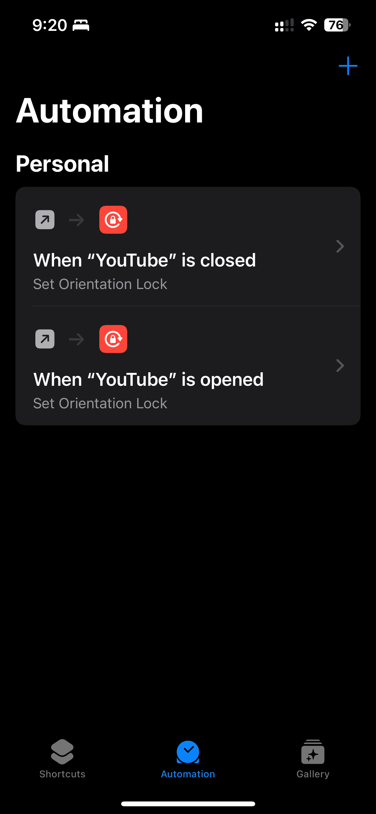

私はiPhoneでYouTubeやTwitchをよく見ます。約1年前、友人の{link:@yuki-yano}さんが{link:vim-jp} Slackで素晴らしいショートカットを紹介してくれました。今では、このショートカットなしの生活は考えられません。

このショートカットを設定すると、YouTubeアプリを開いたときに画面の回転ロックが解除され、アプリを閉じると再び有効になります。私はTwitchアプリにも同じ設定をしています。

{.w-1/2 .mx-auto .block .my-4}

ぜひ試してみてください！
