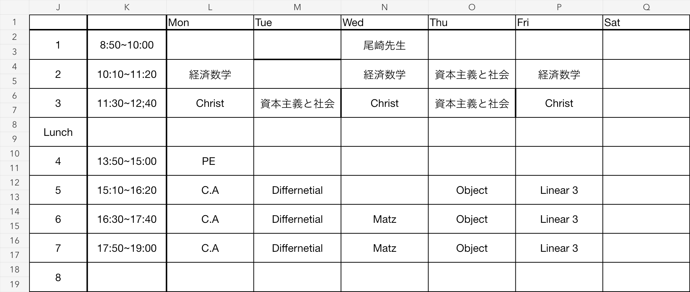
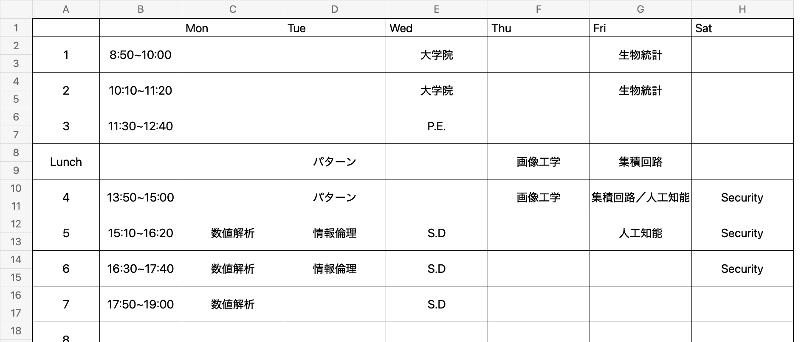
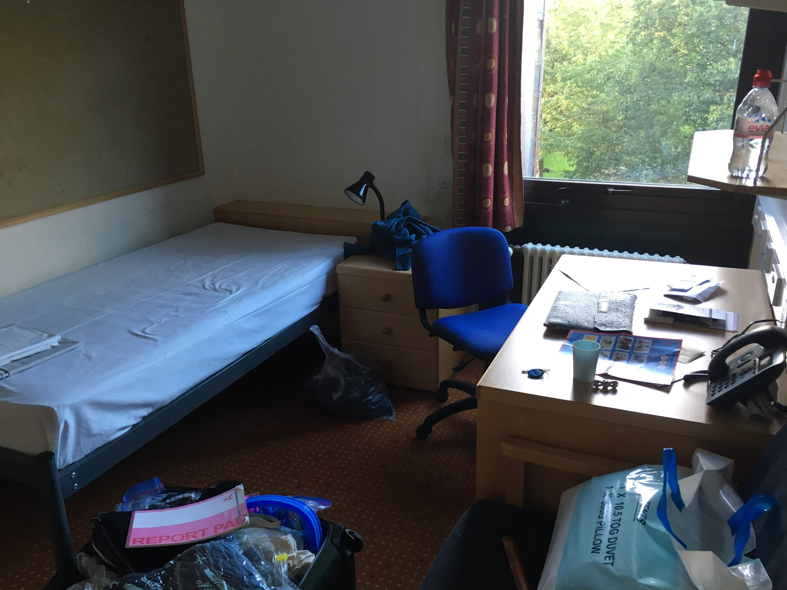
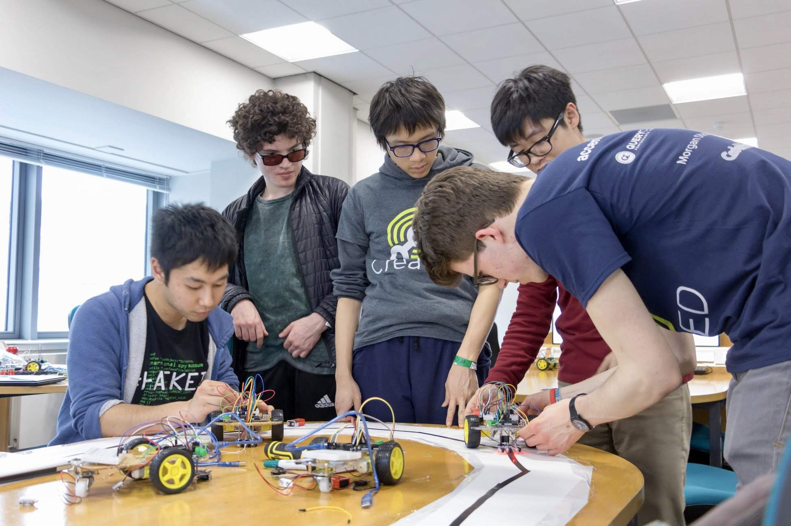
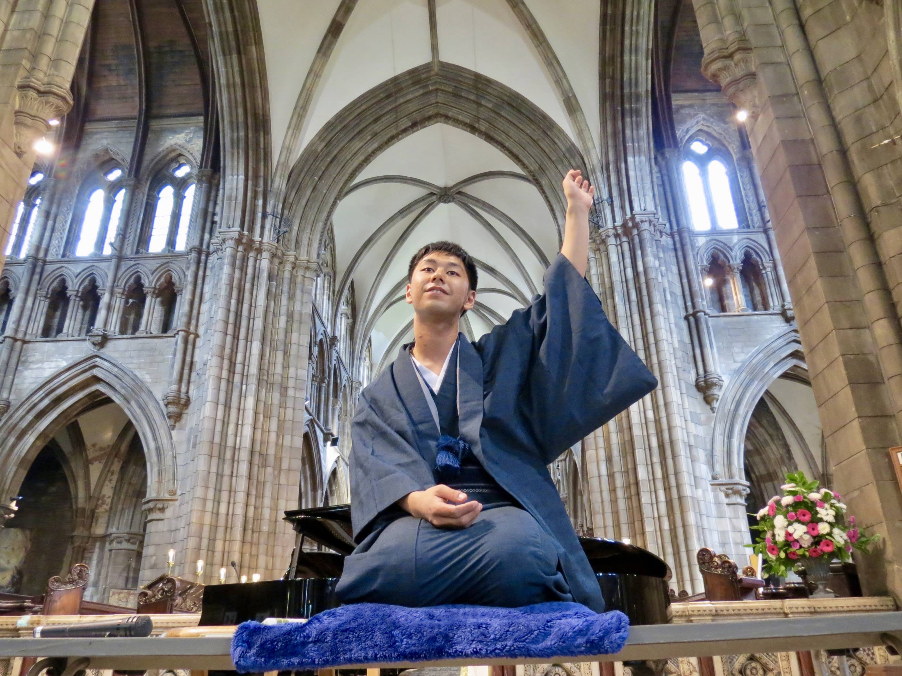
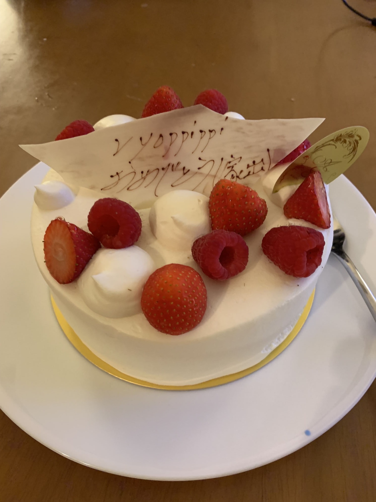

<NotByAI />

1ヶ月前にGTVについて記事を書いた。

<ogcard url="https://ryoppippi.com/blog/2026-07-30-uk-gtv-ja/" />

この記事の中で自分は

> 20代の最後に一発逆転した

と書いた。

これを読んでくれた友人の一人から、「自分なら人生を『逆転した』と思うことはないんだろうな」という感想をもらった。

自分の場合、「逆転」そして「逆襲」という発想が出てくるのはなぜなのだろう。

誰に対して「見返したい」のか。

そして、なぜ今でも自分は「逆襲」という言葉を頭の中で反芻しているのだろうか。

このブログに類するものを書くタイミングは、これまで幾度となくあった。家出をした時、UKへ移住した時、UKで就職をした時、30歳を迎えた時、ビザを取れた時。

現時点での整理をここに記したいと思う。公開するかはおいておいて。

> [!WARNING]
> この記事には暴力を含んだ情景描写があります。苦手な方はご注意ください。

---

> 東大にぱっと入れる頭もなければ、コミュニケーション能力もないお前が社会でやっていけるわけがないだろう。笑わせるな。

これは、2018年の6月、父親に言われた言葉だ。

当時22歳。Edinburgh留学を終えて帰国し、日本の大学に復学するタイミングで、院試を控え、今後の進路について悩んでいた。

何度もこれに類する文章を書いては消すのを繰り返してきた。苦しんで苦しんできた。何度も何度も、毎日毎日、この言葉が俺の頭の中で再生され、俺を苦しめ続ける。

8年経って、縁を切って家出をして7年経って、実際には俺は社会で踏ん張っている。なのに、なぜ今でもこの言葉に反論したいのか。

---

手元にある幼児教室の連絡帳。ここには毎月の先生からのお便りが記されている。
「本当に製作ものが大好きで、毎日、なにかしら作っています」とある。
マジックをしたり、工作をしたり。お店屋さんごっこでは一人で独自路線を突き進むものの売り切れを達成し、年長になると年中の子たちを束ねて玩具屋さんを仕切っていたらしい。

父親は学研の科学キットやレゴなどを与えてくれた。幼稚園の時は、友達が持っていた乾電池と豆電球が最先端のテクノロジーだった。
小学2年生の時には、将来ノーベル賞を取りたいという夢を友達に言っていた。
小学校低学年の頃は、親の前でパソコンを使い、レゴのコマ撮りで映画を作ったりしていた。

小学校3年生の時、[LEGO MINDSTORMS](https://www.lego.com/ja-jp/themes/mindstorms/about)を買ってもらった。
解説本を読んでいくと、何やら英語のような文字がページにぎっしり書いてあった。それが自分のプログラミングとの出会いだった。
しかし、そこから中学受験が始まった。

---

うちの両親は教育にはかなり厳しかったと思う。
小学校に上がる前から、殴られる、水をかけられる、家の外に出されるのは当たり前だった。

公文などの学校以外での学習はしていた。だが、入学する時に、その知識をひけらかせばやめさせると脅されていた。勉強しか取り柄のない自分には、褒められる環境が実質的になかった。
運動もからきしダメだったし、基本的にはできないところを親に指摘されるだけ。「お前は仕事ができない」と言われ続けてきた。

小さい頃から、祖父母には、社会はピラミッドで、いい大学に行けば仕事を選べるのだと言われていた。

中学受験が始まると、偏差値という形で客観的に自分の実力が分かった。成績は親の怒りの種でもあった一方、客観的事実として自分の心を守ってくれるものでもあった。

母親は毎日、教材をコピーし、弁当を作り、塾への送迎もしてくれた。
勉強にも母親がつきっきりだった。漢字や些細なミスがあると定規で殴られ、なぜできないのかと責められ続けた。30cmのプラスチック定規は俺を叩き続けて折れてしまったが、セロハンテープで補強され、それでまた叩かれる日々が続いた。
慣用句やことわざを知らなければ、テレビでやっていると責められた。NHKくらいしか見せてもらえないのに。

父親は毎日顔を合わせるわけではなかったので回数自体は少なかった。
ただ、小6でテストから帰ってきた夜、塾の教科書とノートを全て風呂場に投げ込まれ、シャワーでぐしょぐしょにされたことは今でも鮮明に覚えている。俺はそれを一冊一冊拾い上げ、乾かした。翌日、塾にヨレヨレの教科書を持っていくのがとても恥ずかしかった。

小6の頃は朝7時半に学校へ行き、帰宅後は塾の勉強をして、塾へ行った。帰ってくると夜11時頃だった。土日も塾だった。

小学校の時は小遣いはもらってなかった。
毎週テストの前日に家出をしていた。駅の周りをうろつき、自動販売機の裏にコインが落ちていないか探していた。

---

ゲーム機も禁止、パソコンも禁止、ネットも実質的に禁止であった。
ネット上でもゲームを禁止するかどうかはよく話題になると思うが、2000年代を小学生として過ごした人の中で、24歳になるまで自分のゲーム機を持ったことがない人がどれくらいいるだろうか。

中高は楽しく過ごせたが、小学校ではゲームもテレビも音楽も話題についていけずに苦労した。

携帯電話も大学1年の夏まで、月330円で親とのメールと電話だけができるガラケーだった。
高校で部長になった時は、連絡事項を副部長に転送し、彼に部のLINEグループへ投稿してもらっていた。

小6の時に[iPhone 3Gが発売された](https://www.apple.com/jp/newsroom/2008/07/10iPhone-3G-on-Sale-Tomorrow/)。塾の帰りの携帯ショップなどで触っていたのを覚えている。iPhoneのアプリが作れることを知り、自分でも作ってみたくなった。
中学受験が終わったらMacを買ってほしいと親に頼んだ。すると父親は「渋幕に特待で受かったらパソコンを買ってやる」と言った。

もちろん特待でなんて受かるわけなかった。

中学高校でパソコンに触れなかったのは俺の実力不足だったと、6年間自分を責め続けた。

中学に入学すると、落語研究部と同時に、コンピューターや電子工作を扱う部活に入ろうとした。しかし、その部が文化祭でゲームを作って展示していることを知った母親に、

「ゲームやらせるために学費払ってない」「父親にどう説明するの」

と言われた。隠れてやれば学校を辞めさせると脅された。
それでも近くでPCを見たかった自分は、その部の電子工作班に入った。
半年は所属していたが、周りがプログラミングを楽しんでいるのを見るのが辛くなり、退部した。

アルバイトは禁止で、小遣いは月1500円だった。2ヶ月間貯めて、本を一冊買うような生活をしていた。

定期テストである順位を下回ると小遣いから罰金を取られ、高校で学年10番以内に入ると数千円のボーナスをもらえた。しかし、ボーナスをもらい続けると制度自体が廃止された。

17歳の時、小遣いや成績のボーナスを貯めたお金で、2万円の中古パソコンを買おうとしたが、母親に止められた。
同じ金で1万円のヨーヨーの福袋を買ったら、金銭感覚がおかしいと言われた。

小学校の卒業文集にはジョブズみたいに人を感動させるものを作りたいと書いていたのに、父親には「プログラミングなんて就職してからできる、英語をやれ」と言われ、パソコンには触らせてもらえなかった。一方、母親には「若いうちに頑張らないといけない」と言われ続けた。

親は俺の「執着」をよく理解していた。

市の広報に載った、情報オリンピックに出た同学年の子の記事の切り抜きを、母親に机の上に置かれたこともある。「関心があるかと思って」と言っていたが、こんなグロテスクなことはない。

中学生の頃は、思いついたアプリのアイデアを自由帳に書き溜めていた。
図書館でPythonやJavaScriptの本を借り、ノートにコードを書いて、家電量販店の展示PCのメモ帳に打ち込んで試していた。
GitHubやTwitterのアカウントも携帯ショップの展示PCで作った。

毎月図書館でMacの雑誌を借りて、むさぼるように読んでいた。アプリの紹介も、iOSアプリの開発記事も、そこで読んだ。
iPhoneが欲しすぎて、中高ではiPhoneのペーパークラフトを市の図書館で印刷し、ボロボロになるまで持ち歩いていた。今でも友人の間でネタにされている。
自分は実機を持っていないのに、友人たちにアプリを勧めていた。

[Life is Tech](https://life-is-tech.com/)のことも、雑誌で知っていた。友人が行った話を聞いた。羨ましかった。

iPod nanoは、ネットに繋がらないからか、中学に入るときに買ってもらった。ただし、英語のリスニングに必要なPodcastや教材以外は消せと言われた。
一方で、自分の英語力のほとんどは、通学中に擦り切れるほど見たSteve JobsのKeynote、Jony Iveのビデオ、TEDが元になっている。
当時流行っていた曲のほとんどは大学以降に友人たちが歌うのを見て初めて知った。
最近平成リバイバルが少し流行ったが、自分は懐かしさを感じることができていない。

---

中学も大学も第一志望には落ちた。[ICU](https://www.icu.ac.jp/)に入ったのは、入学した後に専攻を変えられるからだ。
どちらも行ってよかったと思う。でも、あそこまで時間と労力をかけなくても、同じ学校には行けたんじゃないかとは思う。

祖父母が入学祝いに出してくれた金で、MacBook Proを買った。
SSDは128GB。Appleの店員に「本当に大丈夫ですか」と聞かれたが、親は足りない中で工夫するのが学生だと言った。
SDカードを挿して容量を足し、3ヶ月ごとにmacOSを入れ直して使った。
このMacBookでAndroidエミュレータを立ち上げてLINEのアカウントを作った。
移動時間に連絡をすることはできなかった。

コードを書きたいと思った9歳から約10年経って、初めて自由に書ける環境ができた。
ただ、自由に書き始めることができたわけではなかった。

いい学校に行かせているのだから元をとるようにと、何度も言われた。
「人生は逆走エスカレーターなのだからサボるな」と言われた。

出資者、株主の言うことに逆らうことは死を意味していた。

大学に入って好きに履修を選べるようになったのに、好きなように勉強を始めることができなかった。
入学直後に4年分の履修計画をきっちり立て、留学中の単位を全部落としても卒業できるような時間割を組んだ。
一人暮らしは認められなかった。
大学まで往復5時間かかるのに、週25時間以上授業があり、予習復習もあり、週末にはバイトがあり、三つのサークルに入っていた。
大学2年の秋には交換留学の準備も重なり、頭に十円ハゲができた。

<figure>

<figcaption>大学2年の秋学期。週25コマ、29時間。今見ても頑張りすぎだと思う。</figcaption>
</figure>

<figure>

<figcaption>大学3年の春学期。25.3単位、週25時間。昼の4科目は農工大。ICUから歩いて往復した。</figcaption>
</figure>

毎学期親に成績表を提出し、GPA4.0を取れなかった学期には謝罪もした。

大学の時のエンジニアバイトも、無理だからやめておけと言われて行くことができなかった。

---

専攻は後から選べた。色々見た結果、結局情報科学からは逃れられなかった。

1年生の秋学期、初めてC言語を授業で学んだ。
for文やif文、ポインタなどの入門から始まり、最後には競技プログラミングの問題を解く課題があった。
往復5時間の通学や授業の空き時間をすべてこれに注ぎ込み、クラスで1位を取ることができた。

自分はGPAを最大化することを目的に動いていたので、学期中は遊びみたいなものはできなかった。
その秋休み、授業で使ったナップサック問題をiOSアプリにしてみた。これが初めてのiOSアプリだった。
次の春休みには、2048などのゲームをProcessingで移植したりした。

2016年はICUのサマーコースで日本語や日本文化を留学生に教えるバイトに明け暮れた。

転機になったのは、2017年の夏休みに作った[影のキャンバス](https://ryoppippi.com/blog/2017-07-22-silhouette-on-canvas-ja)だ。
Kinectとプロジェクターを使って何をやってもいいよ、とお題を渡され、自由に制作した。
土壇場でどうにか間に合わせ、当日、実際のお客さんに自分の作ったものを使ってもらえた。嬉しかった。
もともとマジックやショービジネスに興味があり、落語をやってきた。エンジニアリングで作ったものでも、人を幸せにできる。

<!-- https://www.youtube.com/watch?v=MngEJwk5KPU -->
<YouTube id="MngEJwk5KPU" />

その後、Edinburghに留学した。
実家で一人になれるのはトイレくらいだった。留学先の寮で、初めて自分の部屋を持った。

いろいろな人にお世話になりながら、とても難しい授業に取り組み、奮闘した。成績はめちゃくちゃ悪かったが、得るものはかなり多かった。
領事館の人たちと仲良くなり、あちこちで英語の落語をする機会があった。ヨーヨーのヨーロッパ大会に行って入賞もした。
落語もヨーヨーも、親から与えられたものではなかった。とても良い留学だったと思う。

ただ、情報科学の授業で周りにいた人たちは、入学前からコンピューターを触っていた。自分は相当に遅れていると感じた。

帰国後、その現状を親に訴えると、一人でやっていけと言われた。
卒業したら自力でやっていく。大学院の学費もどうにかする。そう言ったところ、あの言葉が飛んできたのである。

留学中、期末試験の勉強をしている頃にも、家族LINEに[大学院に行くと人生が終わるという記事](https://gendai.media/articles/-/54972)が送られてきた。

---

大学院には無事合格した。大学4年生ではスタートアップの立ち上げに関わることになった。
大学4年の頃には、研究室で寝泊まりすることもあった。
とりあえず家を出る用意は整った。
やっと「株主」から解放されるのだと思った。

それでも感謝の印に、大学の卒業論文を製本して親に渡した。ただし読まれることはなかった。

理論的には家を出られる状態になっても、しばらくは実家から大学院と仕事に通った。しかし、家での衝突は絶えることがなかった。
あまりにも家に帰るのがしんどくなっていた時、大学院の先輩たちに、とりあえず避難しろと、温かい言葉をかけてもらった。

2019年6月9日、23歳の誕生日。俺はスーツケース二つで家を出た。

家が決まるまでの1ヶ月半、先輩たちのシェアハウスを転々としたり、研究室の床で寝たりしていた。
まだ理性的な対話ができると思っていた父親に保証人を断られ、明日住む場所も分からなかった。

それから7年、実家の誰にも会っていない。

あの時の先輩方がいなければ、あの夜の判断がなければ、今の俺はいないだろう。

スタートアップの給料で学費と家賃を払うとぎりぎりだった。
家が落ち着いた秋に、帯状疱疹が出た。

それでも、好きなことができるようにはなれなかった。

スタートアップでも、自分の興味の範囲で社会的成功を目指そうと思っていた。
研究も、やりたいことがあって入ったのに、それを見失ってしまった。学位しか見えていない時期が長くあった。
人の研究ばかり手伝って、お前は何をやりたいんだと指導教員を心配させたこともあった。

自由を与えられても、偏差値がGPAに、学歴に、社会的地位に、変わっていってしまった。

「俺は社会でやっていけない」という声を、ずっと頭の中で聞き続けていた。
そんなことはないと思っていた。

---

間違いなく大きな転機の一つは、結婚してUKに移住したタイミングで始めた[Neovim](https://neovim.io/)、そして参加した[vim-jp](https://vim-jp.org/)であった。

純粋に面白い技術やおもちゃについて、皆が自由に語っていた。
何か不具合を見つけると、すぐに `:contribution-chance:` スタンプが押される。そこでOSSで共同作業することを覚えた。
技術記事を書くことも奨励された。

といっても、それはまだVimに閉じていて、自分の環境整備の範囲でしかなかった。
それでも、適当に作って、公開して、楽しい。その土台はここでできた。

この時はまだ日本の仕事もしていたし、博士課程にもいた。
親の言葉は鳴り続け、日本とリモートワークをしながら将来から目を背けていた。

---

2024年、28歳で大学院を片道切符で休学し、無職になった時、俺は全てのレールから外れた。

目の前にあったのは、UK就職か、日本へ帰って就職するか、そしてMacBookだけだった。

将来は真っ暗だった。

就活もやりたくはなかった。それまで日本で就活をしたことはなく、基本的に仕事はいつも知り合いからもらえていた。
落とされることで、社会でやっていけないことを証明するのではないかと恐れていた。

現実逃避に選んだのはOSSだった。

誰も今までの評価軸で自分を評価してくれない。だからこそ自由にやりたいことをやり、だからこそ数えきれない苦労の連続だった。

そして、友人たちの奮闘をきっかけにUKでの就職活動を始めた。
実際に英語、つまりコミュニケーション能力の低さで落とされることも多かった。

結果的にUKでの就職に背中を押してくれた妻には感謝している。

その後の自分の2年間を知る人は少なくないだろう。

- 無職
- [typiaへのcontribution](https://ryoppippi.com/blog/2024-12-31/)
- [初めてのGitHub Sponsorship](https://ryoppippi.com/blog/2024-12-31/)
- [1年で16のOSSを作り、25本の技術記事を書いた](https://ryoppippi.com/blog/2024-12-31/)
- AI以前に[年間1万コミット](https://kaigaicareerlog.com/episodes/632fa85d-e2f1-427a-80f5-90d2f221599e/)
- UKでの就活、[533ポジションへの応募](https://ryoppippi.com/blog/2025-07-06-how-to-get-job-in-the-uk-ja/)
- [韓国WRTNからのヘッドハント](https://ryoppippi.com/blog/2026-01-07-recap-2025-ja/)
- [StackOne in Londonからの内定](https://ryoppippi.com/blog/2025-07-06-how-to-get-job-in-the-uk-ja/)
- UK就職を決めた2日後に思いつきで作った[ccusage](https://ccusage.com/)
- [UKでの現地就職](https://ryoppippi.com/blog/2025-07-06-how-to-get-job-in-the-uk-ja/)
- [Bunへの面接で初めて訪れたSF](https://ryoppippi.com/blog/2026-01-07-recap-2025-ja/)
- [Rorkへのジョイン](https://ryoppippi.com/blog/2026-07-30-uk-gtv-ja/)
- [UK Global Talent Visa Exceptional Talent取得](https://ryoppippi.com/blog/2026-07-30-uk-gtv-ja/)
- [Tech WorldやFindy等のメディア](https://ryoppippi.com/blog/2025-11-06-japan-trip-ja/)に呼ばれるようになる

「自分にとって」面白いものを作り続けた2年間だった。

親にプログラミングから遠ざけられていた約10年。Macを手に入れてからも、自分のやりたいことを自由にできるようになるまで、さらに約10年かかった。

コードを書きたいと思ってから、約20年。

俺にとって、こうしてエンジニアリングができることは当たり前じゃない。ありがたいと思う。

---

今はコードを書くのが楽しい。
それでも、「逆襲」がちらつく。

誰を、何をもって見返そうとしていたのだろうか。
本当に「見返す相手」は存在したのだろうか。

高校の時に、あまりにも理不尽な叱責を繰り返す母親にキレたことがある。その時に言われた言葉は、

> 世間の目はもっと厳しい。周りに理不尽なことを言われても「何クソと思って」見返すしかないだろ。男のくせにピーピー泣いてんじゃねえよ。

この「逆襲」も、「見返せ」という戦い方も、親から受け継いだものなのではないか。

30歳を迎えた今、この呪いから離れることはできるのだろうか。

そして今日も、「お前は社会でやっていけない」「出来損ないの息子」という声が頭の中で鳴り響いている。

---

俺の人生は逆襲なんかじゃない。

なのに、何かを成し遂げると、今でも「影」がちらつく。

全部を肯定できるわけじゃない。それでも、俺の人生は俺が肯定したい。

これは、本当に逆襲だったのだろうか。
