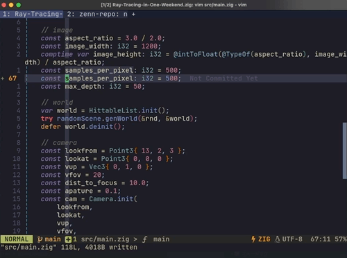

# はじめに

ここ数週間でホットな言語、[Zig](https://ziglang.org/)を触っている。
何か作りたいなと思っていたが、以前からやってみたかった[Ray Tracing in One Weekend (週末レイトレーシング)](https://raytracing.github.io/books/RayTracingInOneWeekend.html)をやってみることにした。


_最終的に生成される画像。うっとりする_

https:-/github.com/ryoppippi/Ray-Tracing-in-One-Weekend.zig

https://raytracing.github.io/books/RayTracingInOneWeekend.html
https://inzkyk.xyz/ray_tracing_in_one_weekend/

# 所感

本文はC++で書かれているが、クラス、継承、演算子オーバーロード等の概念はZigにはないため適宜工夫する必要があった。
また、筆者が普段(型の緩めな)PythonやJSを主に使っているため、終始コンパイラに叱られっぱなしだった^[大学でC言語をはじめて学んだ時を思い出す]。

# 面白い/気になった点

RustやGo、TS等の近代静的型付言語では常識なのかもしれないが、個人的に新鮮だった機能や気になった点をここに列挙していく。

> [!NOTE]
>
> <!-- spellchecker:disable-line -->
>
> この記事内でのZigのバージョンは`0.10.0-dev.3007+6ba2fb3db`です。そのためこの記事の内容は後に古くなる可能性があります。

## コンパイル時にのみ実行されるコード

zigでは`comptime`というマーカを付けることでコンパイル時に評価されるコードを書くことができる。
型情報や定数など、あらかじめ評価できる情報を用いてコンパイラに事前処理をさせるようなもので、ものすごくクールである。
たとえば以下のコードでは受け取る型がintかfloatかで呼び出す関数を変えている（しかもそれ以外の型が渡されたらコンパイルエラーを発生させることもできる）。

`comptime`は変数や引数につけることができる。

https://github.com/ryoppippi/Ray-Tracing-in-One-Weekend.zig/blob/d4e400c1e0e6d51f0ba402d3029954bcf6243128/src/rtweekend.zig#L26-L32

また、`comptime_int`や`comptime_float`なるものも存在する^[https://ziglearn.org/chapter-1/#comptime 参照]。変数がintかfloatかを定義時にはざっくりと、コンパイル時には具体的な型に推論できる特別な型である。

`comptime`を応用すると型を受け取って型を返す関数を定義することができる。C++のTemplateのよう。

<details>
<summary>型を受け取ってstructを返すコード</summary>

```zig
const std = @import("std");
fn Vec(
    comptime count: comptime_int,
    comptime T: type,
) type {
    return struct {
        data: [count]T,
        const Self = @This();

        fn init(data: [count]T) Self {
            return Self{ .data = data };
        }
    };
}
pub fn main() void {
    const v = Vec(3, f32).init([3]f32{ 1, 2, 3 });
    std.debug.print("{}", .{v.data.len});
}
```

</details>

今回の実装では、受け取った型がVector型であるか、またscalarとVectorの型が一致しているかを検証するためにこの機能を活用した。

https://github.com/ryoppippi/Ray-Tracing-in-One-Weekend.zig/blob/d4e400c1e0/src/vec.zig#L141-L151

### **注意**^[筆者はこれに約１日悩まされた。抽象的な型に対する関数を定義するときは気をつけた方がよさそう。]

`comptime`はコンパイル時に評価される変数にのみ使用できる。
Zigでは`constant value`と`runtime value`という２つの用語で区別しているようだ。
なので、以下のコードはエラーになる。

```zig
const std = @import("std");

fn size(comptime v: anytype) comptime_int {
    const T: type = @TypeOf(v);
    return @sizeOf(T); // 定義: @sizeOf(comptime T: type) comptime_int
}

pub fn main() void {
    var v1: i32 = 1; // constでもcomptime varでもないので
    std.debug.print("{}\n", .{size(v1)}); // error: runtime value cannot be passed to comptime arg
}
```

この場合、以下のように変更すると実行できる。

```zig
const std = @import("std");

fn size(comptime T: type) comptime_int {
    return @sizeOf(T);
}

pub fn main() void {
    var v1: i32 = 1;
    const T = @TypeOf(v1); // 型情報は静的なので、constで定義できる
    std.debug.print("{}\n", .{size(T)}); // 4
}
```

## `switch`

`switch`はかなり洗練されていて、パターンマッチングのように使用することができる^[https://ziglearn.org/chapter-1/#switch 参照]。
また、式としても利用することができるので、とても便利^[というか今回の実装では式としか利用していない]。

https://github.com/ryoppippi/Ray-Tracing-in-One-Weekend.zig/blob/7965b1c976/src/rtweekend.zig#L26-L32

## ラベル付きBlock（2022/07/21追記）

ZigのBlock`{}`にラベルを与えると式として使うことができる。

```zig
test "struct" {
    const a = blk: {
        var x: i32 = 3;
        break :blk x + 2;
    };
    std.debug.print("{}", .{a}); // 5
}
```

これを使うと、ちょっとした処理を挟んで値を返したいときにとても便利。
わざわざ関数を作って渡したり、`goto`を多用したり、またそれらを避けるために記述を増やしたりする必要がなくなる。
また、ラベルがついているので、わざわざコメントを書かなくてもわかりやすいコードになる。

https://github.com/ryoppippi/Ray-Tracing-in-One-Weekend.zig/blob/99459216213d109b7414714bd6c0c30c1d57caec/src/randomScene.zig#L41-L59

<details>
<summary>参考: ラベル付きBlockを使わないコード</summary>

https://github.com/ryoppippi/Ray-Tracing-in-One-Weekend.zig/blob/7965b1c9765caab7168152f472fdef540a77a442/src/randomScene.zig#L41-L62

```zig
if (vec.len(center - Point3{ 4.0, 0.2, 0.0 }) > 0.9) {
        // generate a random material
    if (choose_mat < 0.8) {
        // diffuse
        const albedo = vec.randomVecInRange(rnd, Color, 0, 1) * vec.randomVecInRange(rnd,
0, 1);
        const diffuse_material = Material.lambertian(albedo);
        const diffuse_sphere = Sphere{ .center = center, .radius = 0.2,
diffuse_material };
        _ = try world.add(diffuse_sphere);
    } else if (choose_mat < 0.95) {
        // metal
        const albedo = vec.randomVecInRange(rnd, Color, 0.5, 1.0);
        const fuzz = rtw.getRandomInRange(rnd, SType, 0.0, 0.5);
        const metal_material = Material.metal(albedo, fuzz);
        const metal_sphere = Sphere{ .center = center, .radius = 0.2, .mat = metal_material };
        _ = try world.add(metal_sphere);
    } else {
        // glass
        const ir = 1.5;
        const glass_material = Material.dielectric(ir);
        const glass_sphere = Sphere{ .center = center, .radius = 0.2, .mat = glass_material };
        _ = try world.add(glass_sphere);
    }

```

</details>

## 継承の代わりとしての共用体（`union`）

Zigには`union`型が存在する^[https://ziglearn.org/chapter-1/#unions 参照]。
C言語の共用体と同じく、中身のメンバーのメモリは共有される。
共用体はある変数に代入したい型が複数あるときに用いることができる。

オリジナルのテキストではC++のクラスや継承を多用していたが、Zigにはそれらの機能はないため、複数の`struct`をまとめる共用体を作成した。

https://github.com/ryoppippi/Ray-Tracing-in-One-Weekend.zig/blob/7965b1c976/src/material.zig#L17-L33

すごいのは、Zigにはタグ付き共用体（`tagged union`）なるものがある。
これがよくできていて、共用体のどのメンバーが使用されているかを`switch`でパターンマッチングできる。
メンバーの種類に合わせて各々の処理を書くことができるのとても便利。

https://github.com/ryoppippi/Ray-Tracing-in-One-Weekend.zig/blob/7965b1c976/src/main.zig#L40-L50

## ポインタ/定数ポインタ

ポインタ型には定数のもの（`*const`）とそうでないもの（`*`）がある。
`const`で定義された変数（定数）からなるポインタは定数ポインタ（`*const`）という扱いを受けるそうだ。
なので、以下のコードはエラーになる。

```zig
pub fn main() void {
    const x: u8 = 1;
    var y = &x;
    const _y = &x;
    y.* += 1; // error: cannot assign to constant
    _y.* += 1; // error: cannot assign to constant
}
```

`var`で定義された変数なら通常のポインタとなる。

```zig
pub fn main() void {
    var x: u8 = 1;
    var y = &x;
    const _y = &x;
    y.* += 1; // ok
    _y.* += 1; // ok
}
```

## 関数の引数は定数

C言語等と違い、Zigでは関数の引数は定数である。
そのため、引数に代入しようとするとエラーになる。

```zig
const std = @import("std");

fn f(a: anytype) @TypeOf(a) {
    a += 1; // error: cannot assign to constant
    return a;
}

pub fn main() void {
    var a: u8 = 1;
    std.debug.print("{}", .{f(a)});
}
```

仮の変数を経由するか、引数をポインタにすることで実現できる。

```zig
const std = @import("std");

fn f(a: anytype) @TypeOf(a) {
    var tmp = a;
    tmp += 1;
    return tmp;
}

pub fn main() void {
    var a: u8 = 1;
    std.debug.print("{}", .{f(a)});
}
```

## `defer`文

ブロックを抜けるときに実行されるコードを好きな位置に書ける。
Goにはあるようだが、自分には新鮮だった。
たとえば、メモリを確保するコードの直後に解放する処理を記述することができる。バグが減りそうで便利。

https://github.com/ryoppippi/Ray-Tracing-in-One-Weekend.zig/blob/7965b1c976/src/main.zig#L69-L72

## ループ

`for`文がiteratorにしか使えないのはびっくりした。
じゃあ添字がひとつずつ増えていくループを書くときはどうするかといえば、なんと`while`を使うしかないらしい

```zig
fn f() void {
    var i: u32 = 0;
    while (i <= 100) : (i += 1) {
        std.debug.print("{}\n", .{i});
    }
    std.debug.print("done!", .{});
}
```

一昔前のC言語では添字を`for`の中で定義できなかった、という話を思い出した。
ただこのままだと変数`i`に対してスコープも何もないので、`{}`で括るといい感じになる。

```zig
fn f() void {
    {
        var i: u32 = 0;
        while (i <= 100) : (i += 1) {
            std.debug.print("{}\n", .{i});
        }
    }
    std.debug.print("done!", .{});
}
```

## テスト

コード内にテストを直にかけるのが便利だった。
ただ、最近の他の言語では普通？なのかもしれない。

# おわりに

コンパイラに叱られてばかりでめちゃくちゃ実装が遅くなってしまったが、逆に言えば叱られた通りに修正していけば動くようになるのはとても良い体験だった。
また、他言語で実装している人もちらほらいらっしゃるのを拝見したが、今回の実装はだいぶ速く実行されるように思える^[比較のベンチマークをとっていないので、どなたか比較してみてください]。

<details>
<summary>参考: 手元のM1 Mac miniでの計測結果</summary>

```sh
________________________________________________________
Executed in  879.32 secs    fish           external
   usr time  863.33 secs   35.00 micros  863.33 secs
   sys time   15.33 secs  550.00 micros   15.33 secs
```

</details>

今回はとにかく書いていて楽しかったので、また何か書いてみようと思う。

# 関連文献等

- [Zig Documentation](https://ziglang.org/documentation/master/) - わからなくなったらとりあえず見る。ただ標準ライブラリ等はまだ文章化されていないのでレポジトリを見に行く方が早かった。
- [Ziglearn.org](https://ziglearn.org/) - Zigの便利な機能がわかりやすく詰まっている。
- [Gamedev Guide](https://ikrima.dev/dev-notes/zig/zig-crash-course/) - yet another Ziglearnという感じの記事。

# おまけ

ZigのLSPであるZLSはまだまだ発展途上である（変数型の情報が抽出されない、など）。
なので適宜コンパイルをする→コンパイラに叱られる→修正する→...という流れで作業していた。

このとき、エラーを眺めてデバッグするのにNeovimのQuickfixがとても便利だった。


数ヶ月前にメインエディタをVSCodeからNeovimへ移行したのだが、今回そのありがたみを存分に実感できた。

また[vim-jp](https://vim-jp.org)の皆様にもお世話になりました。
