<!-- spellchecker:off -->

> [!NOTE]
> この記事はSvelte/Sveltekitの作者である[Rich Harris](https://twitter.com/Rich_Harris)氏による講演「🌶️ IMHO 🌶️」を翻訳したものです。
>
> この記事の作成には、Whisperによる書き起こし、DeepLおよびChatGPTによる翻訳を補助的に使用しています。
> また、本文中には適宜訳注を入れています。
>
> この場を借りて、翻訳を許可していただいたRich氏、 またこの翻訳をきめ細かくレビューしていただいた[tomoam](https://zenn.dev/tomoam)氏、英文解釈の相談に乗っていただいた[shamokit](https://shamokit.com/)氏へ感謝を表明したいと思います。

https://youtu.be/uXCipjbcQfM

# はじめに [Introduction]

原文

So, I'm going to be giving a talk tonight called In My Humble Opinion, and it's a collection of loosely connected thoughts about recent trends in front-end development.
There's a lot of really interesting and innovative stuff happening in the front-end world at the moment, and this is a good time as any to take stock of it.
So, I'm going to be sharing some opinions of varying levels of spiciness, and I'm going to talk about how those opinions shape the design of Svelte and SvelteKit.
I'm not here to try and convince you of anything.
You'll probably find lots to disagree with me about, but hopefully this will give you some insight into how we think about our role as toolmakers.
Now, it takes a certain lack of humility to stand in front of a room of people and talk for half an hour as if my words mean something, but having said that, I am very aware that some of the ideas I'll be talking about tonight have come from the brains of far smarter and more accomplished people than me, so take everything that I say with a grain of salt. These are humble opinions.
And finally, while I think that the Svelte team would broadly agree with the things I'm going to say tonight, I'm not claiming to speak for them.
I'm also not speaking for Vercel, which is a healthfully pluralistic company, even if we all dress the same.
These are my humble opinions.

今夜は「In My Humble Opinion（私の謙虚な意見）」というタイトルで、フロントエンド開発の最近のトレンドについて、ゆるやかにつながった考えをまとめたものです。
現在、フロントエンド界隈で非常に興味深く、革新的なことがたくさん起こっているため、それを把握するのにいい機会だと思います。
そこで、私はいくつかのスパイシー度合いの異なる意見を共有し、それらの意見がSvelteとSvelteKitの設計にどのように影響しているかについて話します。

私はあなたを説得するためにここにいるのではありません。
しかし、私たちがツールメーカーとしての役割をどのように考えているのか、この講演がそのヒントになれば幸いです。

さて、大勢の人の前に立って30分も自分の言葉に意味があるかのように話すのはある種の謙虚さの欠如を感じます。
そうは言っても、今夜お話しするアイデアのいくつかは、私よりはるかに賢くより優れた人々の頭脳から生まれたものだということは重々承知していますので、私の言うことはすべて大目に見てください。
これらは**謙虚な意見**です。

最後に、Svelteのチームは、私が今夜話すことに大筋で同意してくれると思いますが、私は彼らの代弁者ではありません。
また、Vercelの代弁者でもありません。Vercelは健全な多元的企業であり、たとえ私たち全員が同じ服を着ていたとしてもです。
これらは、**私の謙虚な意見**です。

# フレームワークは問題ない [Your framework is fine] （🌶）

原文

I'm going to start with a fairly non-spicy opinion.
There's too much thought leadership that would have you believe that JavaScript frameworks are the root of all that is wrong with the web, and if only people would make better technology choices, the web would be perfect.
The only problem with it is it is absolute horseshit. When you last went on a recipe website and had to fight through a gauntlet of ads and newsletters and cookie consent banners and the recipe author's story about her childhood memories of Aunt Beryl's butter pecan cookies, and you left thinking, if only they had used a different abstraction for creating DOM elements.
No, you don't.

まず、比較的スパイシー度の小さい意見から始めます。
JavaScriptフレームワークがウェブの諸悪の根源であり、人々がより良い技術選択をすればウェブは完璧になると信じ込ませるようなソートリーダーシップ^[[ソートリーダーシップ](https://adv.asahi.com/marketing/keyword/11053380)]が多すぎるように思います。
ただ、それは完全に出鱈目です。あなたがレシピサイトを訪れた際に、広告やニュースレターやクッキーの同意バナーやレシピ作者の幼少期の思い出話に苦戦した時、別のDOM要素の抽象化を使用していれば良かったのにと思ったことがありますか？
いいえ、そんなことはありません。

# なぜ Web はクソなのか [Why web sucks]

原文

The web doesn't suck because of JavaScript frameworks.
It sucks because of capitalism.
It sucks because of the attention economy, because we pay for everything with data, and because we're all slaves to the algorithm.
On some level, we all know this, and so I've come to believe that, as framework authors, the most impactful thing we can do isn't fixating on a kilobyte here or a millisecond there.
It's empowering developers through education and documentation and diagnostics and sensible defaults to do the right thing in the face of structural forces that bend the web towards sucking it.
The other stuff matters, but probably less than we think, because every now and then, someone will show some data that proves some frameworks deliver better experiences than others.
This is a chart that shows how the main JavaScript-centric application frameworks score on Core Web Vitals measurements.
You can see that only Astro and SvelteKit outperform the average website, but we have to be careful how we interpret this.
For example, Astro explicitly markets itself as being designed for content sites that don't require much interactivity, and so it has a natural advantage over frameworks that are typically used for more demanding workloads.
All of which is to say that, as much as we love to talk about technology choices, for the most part, you shouldn't feel pressured by me or anybody else to switch away from whatever makes you productive at shipping software.

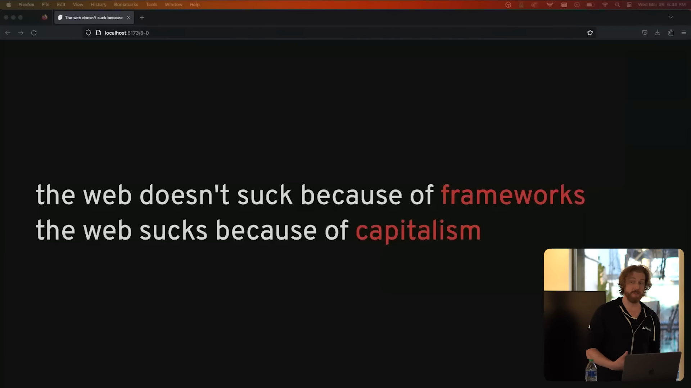

ウェブが駄目なのはJavaScriptフレームワークのせいではありません。
それは資本主義のせいです。
アテンション・エコノミーのせいで、データですべての代金を支払うから、そして、私たちは皆、アルゴリズムの奴隷だから最悪なのです。
私たちは皆、あるレベルでこれを知っていると思います。

したがって、フレームワークの作者として私たちができるもっとも効果的なことは、キロバイトやミリ秒にこだわることではありません。
教育やドキュメンテーション、診断、合理的なデフォルトを通じて、Webを悪い方向にねじ曲げてしまう構造的な力に直面しても正しいことができるよう開発者を強化することです。

他のことも重要ですが、考えているほど重要ではないかもしれません。
なぜなら時折、どこかの誰かさんが何らかのデータを持ち出して、「XXフレームワークはYYフレームワークよりも優れた体験を提供します！これが証拠です！」などという発表したりするからです。

これは、主要なJavaScript中心のアプリケーションフレームワークが、Core Web Vitalsの測定でどのようなスコアを獲得したかを示すグラフです。
AstroとSvelteKitだけが平均的なウェブサイトを上回っていることがわかりますが、これをどう解釈するかは注意しなければなりません。
たとえば、Astroは、インタラクティブ性をあまり必要としないコンテンツサイト向けに設計されていることを明確にアピールしており、より負荷の高いワークロードに通常使用されるフレームワークよりも自然に優位に立つことができます。

つまり、私たちは技術の選択について話すのが大好きですが、ほとんどの場合、ソフトウェア開発で今使用している生産性の高いツールから乗り換えるように私や他の誰かから迫られている、と感じる必要はありません。

# 0kbのJavaScriptは目標ではない [0kb JS is not a goal] (🌶🌶)

原文

Next take something I've seen more and more of lately is people talking about zero kilobytes of JavaScript, as in, this framework ships zero kilobytes of JavaScript by default.
The implication is that JavaScript is inherently bad, and so a framework that doesn't serve JavaScript is inherently good, but zero kilobytes of JavaScript is not a goal.
The goal is to meet some user need, or if you're cynical, to meet some business need by way of meeting some user need, and sometimes performance is a factor in how effectively you can meet that need.
We've all seen the studies showing that for every millisecond delay, Amazon loses a billion dollars or whatever, and sometimes you can improve startup performance by having less JavaScript, but doing so is always in the service of some other objective.
Collectively, we are in danger of mistaking the means for the end, and as we'll see later, if you want the best possible performance, JavaScript is actually essential.
This is something that I see with things like Lighthouse.
Lighthouse is an example of Goodhart's law.
When a measure becomes a target, it ceases to be a good measure.
We're incentivized to chase the green 100 at any cost.
That's not how Lighthouse was originally supposed to be used.
Lighthouse is a diagnostic tool to help us identify and fix issues.
It is not a scorecard.
So this is [learn.svelte.dev](https://learn.svelte.dev), our interactive platform for learning Svelte and SvelteKit.
It gets a pretty lousy performance score, because in order to work, it needs to download and install Node inside your browser along with SvelteKit and Vite, and then it needs to start a development server.
It is doing a lot of work, and it does it pretty quickly, but not quickly enough for Lighthouse.
You could get a better score by only doing that work when you start interacting with the site, but that would be a pretty serious regression in user experience.
I see this pattern over and over again across all different kinds of sites.
A single number simply cannot capture that nuance, and you should be wary of people who use those numbers to try and convince you of something.

最近よく見かけるようになったのは、「このフレームワークはデフォルトで0キロバイトのJavaScriptを出荷しています」という話です。
JavaScriptは本質的に悪いものなので、JavaScriptを使わないフレームワークは本質的に良いものだという意味合いですが、**JavaScriptを0キロバイトにすることは目標ではありません**。
目標はユーザーのニーズを満たすことです。あるいは、皮肉的に言えば、ユーザーニーズを満たすことにでビジネスニーズを満たすことです。
そして、時にはパフォーマンスがそのニーズをいかに効果的に満たすことができるかの要因になることもあります。

私たちは皆、1ミリ秒の遅延ごとにAmazonが10億ドルの損失を被るという研究結果を見たことがあります。
JavaScriptを少なくすることでスタートアップのパフォーマンスを改善できる場合もありますが、それは何か別の目的があってそうするのです。

まとめてみると、私たちは手段と目的を取り違えている危険性があります。後述するように、最高のパフォーマンスを求めるなら、実はJavaScriptは必要不可欠なのです。

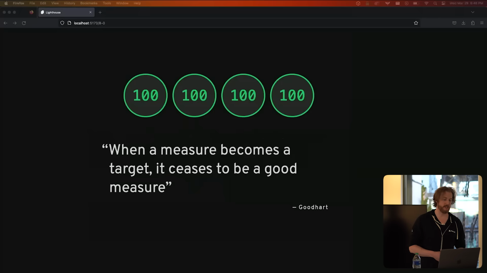

これは、Lighthouseなどで見られるものです。
Lighthouseは、Goodhartの法則の例です^[[Goodhartの法則](https://en.wikipedia.org/wiki/Goodhart's_law)]。ある指標が目的になると、それは良い指標ではなくなります。
何が何でも緑の100点を追い求めるというインセンティブが働くのです。
Lighthouseの本来の使い方はそうではありません。

**Lighthouseは、問題を特定し、修正するための診断ツールです。**
**スコアカードではありません。**

これは、SvelteとSvelteKitを学ぶための私たちのインタラクティブプラットフォームである[learn.svelte.dev](https://learn.svelte.dev)(訳注: 日本語版は[learn.svelte.jp](https://learn.svelte.jp))です。
このLighthouseのスコアはとても低いですが、これはSvelteとSvelteKitを含むNodeをダウンロードしてブラウザー内にインストールし、開発サーバーを起動する必要があるためです。
多くの作業を行っており、かなり速く行っているのですが、Lighthouseの基準では十分な速さではありません。

もしこれらの作業をユーザーがサイトとやり取りするときに行うようにすれば、スコアは改善されるでしょう。しかし、それはユーザ体験を著しく低下させることになります。
私はこれをあらゆる種類のサイトで何度も見ています。
単一の数字ではその微妙なニュアンスを捉えきれないため、それらの数字を使って何かを説得しようとする人には警戒すべきです。

# ほとんどのサイトはJavaScriptなしでも動作するべきである [Most sites should work without JavaScript] (🌶🌶)

原文

Most sites should work without JavaScript.
This might seem like it directly contradicts the previous take, but it doesn't.
These two things are both true.
Number one, JavaScript is necessary to deliver the best possible user experience.
Number two, sometimes you can't rely on JavaScript.
A website I reference constantly is this one.
Everyone has JavaScript, right?
For those of us who live in New York, you're very familiar with the experience of loading
a page while at a subway station, but losing connectivity before JavaScript loads.
It really sucks.
I believe that most web apps should be mostly functional without JavaScript.
Say Google Calendar, for example.
Obviously JavaScript is useful here, but is it essential?
Can I really not see my appointments and create new ones without JavaScript?
The likely answer is, well, we could, but increased development cost isn't worth it.
And I'm not blaming the developers for this or for the product managers for having the wrong priorities, but I do think it's a shame that the tooling used to build apps like this one don't make it easy enough to build progressively enhanced apps.
Ideally, you should get an app that works without JavaScript for free, and that is something
that we on the SvelteKit team strive for.
For example, we server render everything by default, and we spend a lot of time thinking about how to make it as easy or easier to use forms, which work without JavaScript, than it is to use fetch.
Another reason that this is close to my heart is that in my patch career as a journalist, I've seen how fragile the web can be as an archival medium when it ends on JavaScript.

This is Kim Kardashian's Instagram page at various points over the last decade.
Early on, the site was basically just text and images, and we can look at a snapshot today and it's perfectly preserved.
By 2019, you can no longer see the actual images.
They're still there on her account, I checked, but because they're rendered with JavaScript, they're not part of the archive. Finally, by 2020, the growth factors got involved, and you can no longer see anything on Instagram without logging in.
And maybe you don't care what Kim Kardashian was wearing in 2017, but so much of modern culture is mediated through ephemeral digital platforms that there is a real possibility that future historians will have an easier time answering the question, what was it like to live through the space race, than answering the question, what was it like to live through the AI revolution?
I think that's a tragedy.
2016 is an interesting case because the content is actually there when you first load the page, but when the JS loads, it looks at the URL bar, says, hey, this isn't Kim Kardashian's profile, and just nukes the entire page.
And we can't go back to 2016 and fix that.
Frankly, if we could go back to 2016, we might have some other priorities.
But what we can do is ensure that our tools today are flexible enough to continue working when unexpected things happen.
So this is something that SvelteKit actually does out-of-the-box.
The client-side router will gracefully figure out the base URL when it starts up.

To demonstrate this, I've deployed a version of our docs to the interplanetary file system, which is a peer-to-peer network for sharing files.
Click on this link.
So you can see that the URL there has this IPFS slash very long string in front of it.
The catch with IPFS is you don't know that string until you've generated the site because it's based on the content.
So you have this chicken and egg problem.
And yet, it still works.
The client-side routing still works.
Really difficult to use a mouse when you're facing backwards at a screen.
The client-side routing works, he said, without having checked it.
The search function maybe works.
Okay.
So things are working, even though I'm on shared Wi-Fi, and it's a little bit flaky, obviously.

But the point is that SvelteKit is designed to be resilient enough to work even in these fairly hostile environments.

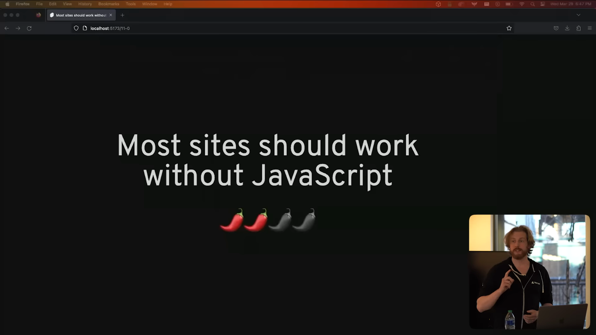

ほとんどのサイトはJavaScriptなしでも動作するべきです。
これは前述の見解と直接矛盾するように見えますが、実際には矛盾していません。
これらの2つのことは両方とも真実です。

**1つ目は、最高のユーザー体験を提供するためには、JavaScriptが必要だということです。**
**2つ目は、JavaScriptに頼れないこともある、ということです。**

[私が頻繁に参照するウェブサイトの1つ](https://www.kryogenix.org/code/browser/everyonehasjs.html)は、この点を説明するのに適しています。

ニューヨーク在住の人々にとって、地下鉄の駅でページを読み込んでいるときに、JavaScriptが読み込まれる前に接続が切れてしまう経験に非常に馴染みがあると思います。それは本当につらいことです。

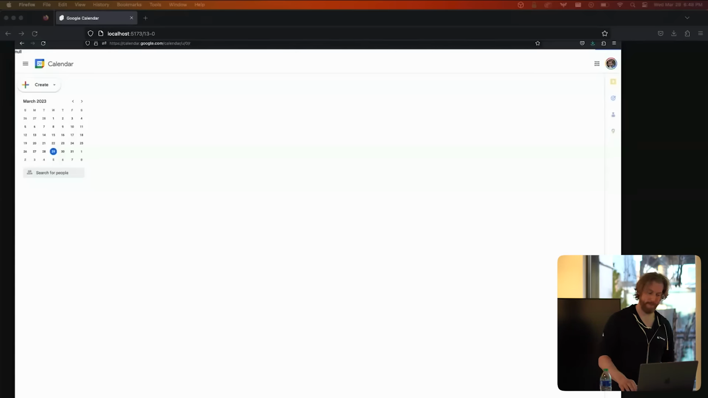
私は、ほとんどのWebアプリはJavaScriptなしでもほとんど機能するべきだと考えています。
たとえば、Googleカレンダーを見てみましょう。
JavaScriptは明らかにここで役立ちますが、それが必要なものでしょうか？
JavaScriptなしで自分の予定を見たり、新しい予定を作成したりできないのでしょうか？
答えは、「できるけど、開発費がかさんで割に合わない」でしょう。
私は、このことについて開発者やプロダクトマネージャーを非難するつもりはありませんが、このようなアプリを構築するためのツールがProgressive Enhancementなアプリを簡単に作れないことをとても残念に思います。

理想的には、JavaScriptなしでも動作するアプリを無料で提供する必要があります。これは、SvelteKitチームが目指すものの1つです。
たとえば、私たちはすべてのものをサーバーサイドでレンダリングし、フォームを使用する際にJavaScriptなしで使用することができるようにする方法について多くの時間を費やして考えています^[[Form actions • Docs • SvelteKit](https://kit.svelte.jp/docs/form-actions)]。

もう1つの理由として、私の過去のジャーナリストとしてのキャリア^[Rich氏は現在はVercelに勤務しているが、その前はNew York TimesでGraphic Editorとして働いていた。[オリンピックでの水泳競技のインフォグラフィック](https://twitter.com/Rich_Harris/status/1419486431534362626)などの作品がある。]の中で、JavaScriptが止まってしまうと、ウェブがアーカイブメディアとしていかにもろくなるかを目の当たりにしてきたからです。
これは、過去10年間のKim KardashianのInstagramページです。
初期は基本的にテキストと画像だけで、今日スナップショットを見ても完璧に保存されています。
2019年になると、もはや実際の画像は見ることができません。
確認しましたが、彼女のアカウントではまだ残っています。ですが、コンテンツはJavaScriptでレンダリングされているため、アーカイブの一部にはなっていないのです。
最後に、2020年には成長要因が関与し、Instagramにログインしない限り何も見ることができません。
あなたが2017年にKim Kardashianが何を着ていたか気にしないかもしれません。
しかし、現代文化の多くは短命なデジタルプラットフォームを通じて媒介されているため、将来の歴史家は、「宇宙開発競争を生き抜くとはどういうことか」という質問に答える方が、「AI革命を生き抜くとはどういうことか」という質問に答えるより簡単になってしまう可能性があるのです。
私はそれが悲劇だと思います。
2016年は興味深いケースです。最初にページを読み込むと実際にコンテンツがあるのですが、JSがロードされると「これはKim Kardashianのプロファイルではない」と表示されページ全体が削除されます。
そして、2016年に戻って修正することはできないのです。
正直言って、2016年に戻ることができたら、他にも優先事項があるかもしれません。
ですが、私たちができることは、今日のツールを柔軟に、かつ予期しないことが起こった場合でも継続的に機能させるようにすることです。

SvelteKitは箱から出してすぐにこれができます。
クライアントサイドのルーターは、起動時にベースとなるURLをとびきり上手に扱うことができます。
また、SvelteKitはかなり過酷なネットワーク環境下でも動作するように設計されていることがポイントです。(訳注: [ここでデモを行う](https://youtu.be/uXCipjbcQfM?t=490))

訳注

Progressive Enhancementの例として、Harris氏は[Svelteflix](https://svelteflix-rich-harris.vercel.app/)を作成しています。
是非ともお使いのブラウザでJavScriptの有効/無効を切り替えて開いてみて下さい。

# MPAは死んだ [MPAs are dead] (🌶🌶🌶)

原文

Okay, getting a little spicier.
This is the first opinion that's probably going to make people yell at me when the recording of this goes on on YouTube in a couple of weeks.
MPAs are dead.
So for those of you who aren't captives of web dev Twitter, let me offer some definitions.
A multi-page app, or MPA, is what people used to call a website.
It's an app where every page is rendered by the server, and if you navigate between pages, the browser will go back to the server, retrieve some fresh HTML, unload the current document, and then create a new document from the new HTML.
In contrast, a single-page app, or SPA, doesn't unload the document when you navigate.
Instead, a client-side router will fetch any code and data it needs for the new page, and it will update the document in place, just like any non-navigation staging.
Now, advocates of the multi-page app approach have made the following claims.
MPAs are faster because you don't need to load JavaScript.
MPAs are more accessible.
MPAs are less buggy.
And MPAs can work without JavaScript.
And in return, the single-page app cam says that SPAs are faster, because even though you do need to load JavaScript, you're probably going to have to load some JavaScript anyway, and this way, you only have to load your analytics or whatever once, instead of every single page load.
And subsequent navigations are certainly going to be faster, because it's much easier to smartly preload data, and you're not recreating the document from scratch on every navigation.
SPAs allow you to preserve state between navigations, such as the scroll position of a sidebar, or the video that's currently playing.
In an SPA, navigation is just like any other state change, so you can do things like continuous transitions.
There's a view transitions API coming to the platform that helps with this, and it's a wonderful addition, but it only covers stuff that you can do with CSS.
You can, for example, tween a numeric value in a progress indicator like this, if you were building a survey app.
And SPAs give you a unified development model.
Instead of having one language for your HTML and another for your DOM, SPAs are much more cohesive.
Now, looking at these two lists, you might say, well, the stuff on the right is nice, but the stuff on the left is non-negotiable, and you'd be right, but the reality is that that list is very out of date.
Modern frameworks like Next and Remix and Sveltekit don't suffer from the problems that afflicted early SPAs, and as we've seen, the claim that MPAs are faster than modern SPAs is highly suspect.
I've tried to argue in the past that the distinction is actually rather unhelpful, since modern frameworks use techniques from both sides, and I've taken to calling them Transitional Apps, because we do not need any more moronic acronyms, but this isn't why I'm saying that MPAs are dead.
I'm saying that MPAs are dead because Astro killed them.
My Astro friends will be mad at me for saying this, but here's the proof.
As of last week, Astro's roadmap includes a client-side router that would turn your Astro app into a single-page app.
In the words of Nate Moore, UI persistence has surfaced as a clear missing piece in the full Astro story.
Client-side routing is currently the only way to achieve UI persistence across navigation.
I'll be quick to point out that this is opt-in, it's not the default, but here's what's going to happen.
They're going to build this thing, and they're going to knock it out of the park, and if it's a simple configuration change, then people will try it, even if they don't need UI persistence, and they'll discover that for the very small price of a client-side router, their app suddenly have a nicer user experience.
I would not be surprised if the default was reversed in Astro 3 or 4.
So on the SvelteKit side, we use client-side routing by default.
Unlike some frameworks, we don't use a link component.
We just use regular A tags and intercept clicks on them.
If you want to disable client-side routing for some reason, you can do it on an individual link by adding a `data-sveltekit-reload` attribute, or you can do it for a whole group of links or even the entire document.
Now one thing that people have rightly criticized SPAs for is that they encourage longer sessions, meaning it's more likely that a new version of the app will be deployed while you're using the old one, which can cause client-side routing to fail because all of the files have moved around.
So in SvelteKit, if we detect that case, we will fall back to a full page navigation, which usually fixes it, but we also make it easy to proactively detect new deployments and disable client-side routing when that happens.

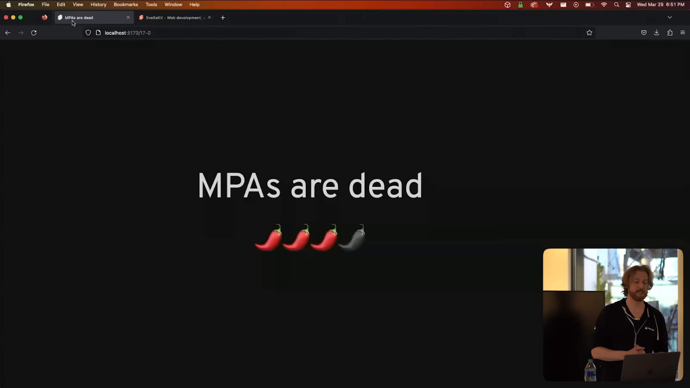

さて、ちょっとスパイシー度合いを上げていきましょう。
これは、数週間後にYouTubeでこの録画が公開されたときに、おそらくみんなに怒鳴られることになる最初の意見です。
**MPAは死んだ**。

というわけで、Web開発者のTwitterアカウントを追ってない人々のために、ここでいくつか定義を説明しましょう。

マルチページアプリケーション（MPA）は、かつてウェブサイトと呼ばれていたものです。
すべてのページがサーバーによってレンダリングされるアプリで、ページ間を移動する場合は、ブラウザがサーバーに戻り、新しいHTMLを取得し、現在のドキュメントをアンロードし、新しいHTMLから新しいドキュメントを作成します。

対照的に、シングルページアプリ（SPA）では、ページの遷移時にはドキュメントをアンロードしません。
代わりに、クライアントサイドのルーターが新しいページに必要なコードとデータを取得し現在のドキュメントをその場で更新します。

マルチページアプリケーションの支持者は、以下の主張をしています。

- MPAはJavaScriptを読み込む必要がないため、より高速である
- MPAはバグが少ない
- MPAはアクセシビリティが高い
- MPAはJavaScriptなしでも動作する

対して、SPA側はこちらの方が速いと主張しています。
JavaScriptをロードする必要があるとはいえ、どうせJavaScriptをロードしなければならないのでしょうし、この方法ならanalyticsなどをページ遷移のたびにロードする必要はなく、1度だけで済みます。
そして、その後のページ遷移は確かにより速くなります。
データをスマートにプリロードすることがより簡単で、すべてのページ遷移でドキュメントをゼロから作成する必要がなくなるからです。
SPAでは、サイドバーのスクロール位置や再生中の動画など、ナビゲーションの間の状態を保持できます。

SPAでは、ナビゲーションは他の状態変更と同じように扱われるため、連続的なトランジションのようなことができます。
先日View Transitions API^[[SPA view transitions land in Chrome 111](https://developer.chrome.com/blog/spa-view-transitions-land/)]が追加され、CSSでこのような遷移を行えるようになりました。
たとえば、サーベイのアプリを作る場合、このような進捗インジケーターでTween Animationを使って数値を動かすことができます。

また、SPAは統一された開発モデルを提供します。
HTMLとDOMにそれぞれ別の言語を使うのではなく、SPAはより一貫性のある開発モデルです。

さて、この2つのリストを見てあなたは「右のものもいいけど、左のものは譲れない」と思うかもしれません。
その通りなのですが、現実にはこのリストはとても時代遅れなのです。

NextやRemix、Sveltekitといった最新のフレームワークには、初期のSPAを苦しめた問題はありませんし、これまで見てきたように、MPAが最新のSPAよりも速いという主張は非常に疑わしいです。

過去に私は、現代のフレームワークが両方の側面の技術を使用しているため、区別は実際にはあまり役に立たないと主張してきました。私はそれらを「Transitional Apps^[Rich氏による[Jamstack Confでの講演](https://youtu.be/860d8usGC0o?t=535)の中で発表された用語。従来のデザインとモダンなデザインの両方の良さを併せ持つ、という意味のようだ。]」と呼ぶようになりました。
しかし、MPAが死んだのはこれらが原因ではありません。
**MPAはAstroに殺されたのです**

こんなことを言うとAstroの友人たちに怒られそうですが、これがその証拠です。
先週の時点で、Astroのロードマップには、Astroアプリをシングルページアプリにするクライアントサイドルータが含まれています。
Nate Mooreの言葉を借りれば、UIにおける永続性がAstroの全貌を語る上で、明らかに欠けているピースとして浮上したのです。
現在、クライアントサイド・ルーティングは、ナビゲーション間のUIにおける永続性を実現する唯一の方法です。
念の為、これはオプトインであり、デフォルトではないことを付け加えておきます。

しかし、これから起こることはこうでしょう。
彼らはこのクライアントサイドルーターを完璧に構築し、実現させるでしょう。
もしそれが設定を少し変えるだけで動かせるのなら、UIにおける永続性が必要なくても人々はそれを試してみるでしょう。
そして、ルーターというとても小さな代償が自分のアプリに突然より良いユーザー体験をもたらすことに気づくはずです。

 <!-- 私はAstro 3または4でこの設定のデフォルトが逆転しても驚かないでしょう。 -->

私はAstro 3または4でこれがデフォルト化されても驚かないでしょう。

SvelteKit側では、デフォルトでクライアントサイド・ルーティングを使用することにしました。
ここでは、いくつかのフレームワークとは異なり、リンクコンポーネントを使用しません。
通常のaタグを使用し、それがクリックされたときに適切にこれを処理します。
もし何らかの理由でクライアントサイド・ルーティングを無効にしたい場合は、`data-sveltekit-reload`という属性を追加します。これは個々のリンクに追加することもできますし、リンクのグループ全体、またはドキュメント全体にも追加することができます。

SPAはセッションが長くなるため、古いアプリを使用している間に新しいバージョンのアプリがデプロイされる可能性が高く、すべてのファイルの場所が変わってしまってクライアントサイドのルーティングが失敗する可能性がある、と批判されることがあります。
SvelteKitでは、このようなケースを検出すると、通常はフルページナビゲーションにフォールバックして解決しますが、新しいデプロイメントをプロアクティブに検出してクライアントサイドルーティングを無効にすることも容易にしています。

訳注

Astroは、登場時にはZero JSを掲げていましたが、その文言は現在は削除されています。
また、AstroのCEOであるFred K. Schott氏はこれに反対しているようです。
https://twitter.com/FredKSchott/status/1648963240779558915?s=20

# 明示的なDSLは良いものです [Explicit DSLs are good] (🌶🌶)

原文

Alright, next opinion is that explicit DSLs, domain-specific languages, are good.
DSLs get a bad rap.
I lie to them.
DSLs are in contrast to general-purpose programming languages like JavaScript.
HTML is a DSL, CSS is a DSL, JSON is a DSL, SQL is a DSL, regular expressions are a DSL.
We don't tend to think of those as such because they're already so pervasive and people are fine with the DSLs that they already know, but you can do some pretty cool stuff with DSLs.
This is LuCy by Matthew Phillips, and it's one of my favorite examples from recent memory.
It's a DSL for describing state machines, and you can clearly see how much more expressive the DSL version is than the general-purpose one.
This is cool, and I want to see more stuff like this.

次の意見は、明示的なDSL、つまりドメイン固有言語は良いというものです。
DSLの風評被害はすごいです。
私はそれらの意見を嘘つきだと思っています。
DSLはJavaScriptのような汎用プログラミング言語と対照的です。
HTML、CSS、JSON、SQL、正規表現、これらはすべてDSLです。
私たちはこれらをすでに広く使っているため、それらをDSLと考える傾向はありませんが、DSLを使ってかなりクールなことができます。

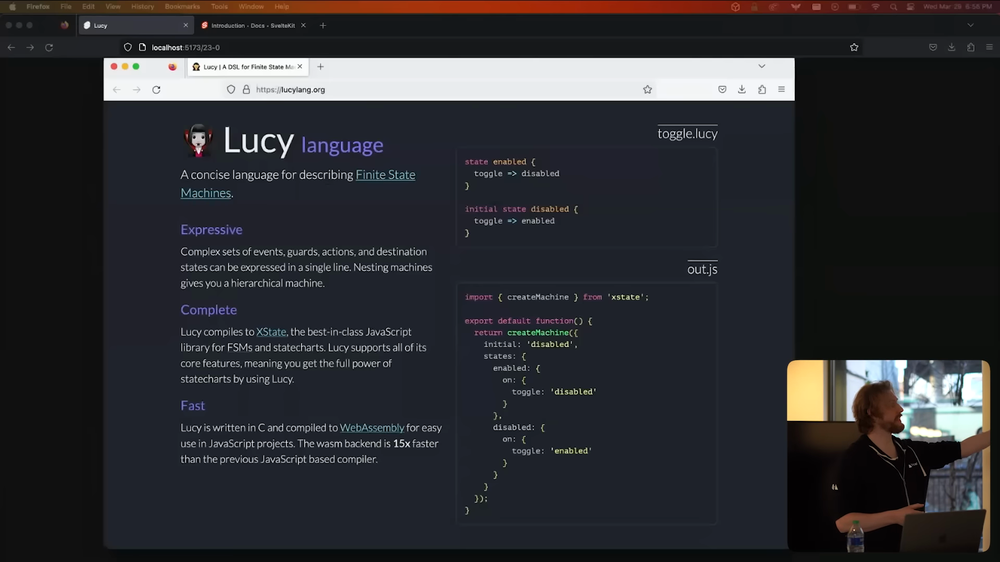

たとえばMatthew Phillips氏が開発している[LuCy](https://lucylang.org/)は私の最近のお気に入りの例の1つです。
これはステートマシンを記述するためのDSLであり、汎用言語よりもDSL版の方がどれだけ表現力が高いかがよくわかると思います。
私はこのようなクールなものをもっと見たいと思っています。

# JavaScriptはイベント駆動、UIは状態駆動 [JavaScript is event-driven; UI is state-driven]

原文

You see, fundamentally, JavaScript is an event-driven language, which means that we predominantly write code in terms of things that are changing in response to things like user action.
But when we build user interfaces, we're thinking primarily in terms of state.
This is the imperative-declarative split, or whatever you want to call it.
So there's an impedance mismatch at the very foundation between the language that we're forced to use and the task for which we're using it.
Things like JSX and hooks and signals and all of the other innovations of the front-end world over the last decade or so are all in some way an attempt to resolve that contradiction by letting you write code that is state-first.
HTML, on the other hand, is a really good language for describing UI.
There's no temporal aspect to it.
It's almost like a physical substance like clay, or at least that's how I think of it.
The catch, of course, is that HTML is static, so you can't use it to describe things with rich interactivity.
But what if we started with HTML and used that as a springboard to create a new DSL?
Well, that's basically what Svelte is.
We've augmented HTML with state and control flow, we've augmented CSS with scope styles, and we've augmented JavaScript with reactivity.
Some people are really put off by this, and that's totally fine.
For people who aren't anti-DSL, we've found that this hits a sweet spot between familiarity and novelty.
We're using languages that you already know, but we're extending them in useful ways, and like with the Lucy example, we're able to express UI much more concisely this way.

JavaScriptはイベント駆動型の言語なので、「コンテンツはユーザーのアクションに応じて変化するものである」という観点でコードを書くのが基本です。
対して、ユーザーインターフェイスを作るときには、主に状態という観点から考えます。
これが、命令型と宣言型の分離、などと呼んだりします。
つまり、私たちが使わざるを得ない言語と、それを使用するはずのタスクとの間には、根本的な思考回路の不一致があるのです。

JSX、フック、シグナル、そして過去10年間におけるフロントエンドの世界のすべてのその他の革新は、すべて、状態を最優先にしたコードを書くことができるようにするための試みであり、この矛盾を解決しようとする試みです。

一方、HTMLはUIを記述するために非常に優れた言語です。
時間的な側面がなく、 粘土のような物理的な物質に近いというか、少なくとも私はそう考えています。
もちろん、HTMLは静的なものなので、リッチでインタラクティブ性を持つものを表現するのには使えません。
**ではHTMLを出発点にして新しいDSLを作るとしたらどうでしょう？**
それがSvelteです。

私たちはSvelteで、HTMLを状態と制御フローを備えたものに、CSSをスコープスタイルなものに、JavaScriptをリアクティブなものに拡張しています。
一部の人々はこれに対して本当にがっかりしているかもしれませんが、それはそれでいいんです。
DSLに抵抗がない人たちにとっては、Svelteは親しみやすさと新しさの間のスイートスポットであることがわかりました。
私たちがよく知っている言語を便利に拡張することで、Lucyが成し遂げたように、SvelteではUIをより簡潔に表現することができるのです。

# 暗黙のDSLは...あまり良くないです [Implicit DSLs are... less good] (🌶🌶🌶)

原文

So I am pro-DSL, but there is a crucial caveat.
You have to be honest about it.
In the Svelte case, we're using .svelte files.
When you open a .svelte file, you're entering a kind of liminal space where the normal rules of programming are briefly suspended, and again, some people want nothing to do with that, and that's fine.
I think most of us like having a little magic in our lives from time to time.
Here's where it starts to get a little bit too weird for me.
If you start changing the semantics of JavaScript inside JavaScript files, I'm out.
This has been a recurring theme recently across a whole bunch of different projects, and it's a phenomenon that I think deserves a little bit more scrutiny than it's currently getting.
Before I give you an example of this, I'm going to tell a little story.
Back in 2015, I was working on Rollup, the JavaScript module bundler, and I implemented a heuristic that I thought was pretty clever.
If you weren't using the imports from a given module, like ease and transition from D3 transition there, then Rollup simply wouldn't add it to the module graph, it would just discard it.
As an escape hatch, if you did need to add the module to the module graph anyway because of some side effects, then you could add the import without any specifiers, and then Rollup would include it.
I was young, and I was naive, and this seemed like a really smart optimization.
Around the same time, the D3 community had browbeaten Mike Bostock into using a module bundler, and he basically said, fine, I'll rewrite everything in CommonJS and use Browserify.
I was horrified by this, because that meant the D3 bundle was going to get slow and large, and so I cold emailed him and said, hey, I really think you should use JavaScript modules for this, and tooling isn't quite there yet, but, like, here's the thing that I'm working on.
And that was on May 27th, 2015, and on May 29th, he started filing issues on Rollup, which I didn't even expect and was kind of terrified by, and this is an example of one of them.
Now, Mike is the nicest, most wonderful man, and he is much too kind to put it like this, but what he's saying in this issue is JavaScript doesn't work like that, you numpty, and he's right, it doesn't.
You can't just remove modules from the graph without fundamentally altering the semantics of the code.
I've fast-forwarded a few years, and some frameworks have decided that ignoring the semantics of JavaScript isn't just okay, it's actually a core selling point of the framework.
I'm going to use Remix as an example, but it's not the only one.
Prior to version 13 in the introduction of the app router, Next.js did something similar for example.
This is a Remix route.
The idea is that your server code, which loads data, can be co-located with your view code.
When the client app is built, the loader, and anything that it depends on, is tree-shaken away.
But this isn't tree-shaking, this is made-up, non-standard JavaScript semantics.
You might think, all right, Rich, you poindexter, who made you the JavaScript hall monitor? And you'd have a point, but it does have real-world impacts.
There is actually a whole page in the Remix doc about working around the problems created by this design.
And aside from the practical impacts, there's something about the blurring of boundaries between server and client that I think is inherently confusing.
I've heard multiple people say that they're often not entirely sure where their code is going to end up running.
More alarming to me is the possibility that you could end up with server code in your client bundle.
Even Michael, who invented Remix, acknowledges that this is a real-world problem.
You're one sleep-deprived mistake away from accidentally including something sensitive in the JavaScript that you serve to users.
And even if you don't make that mistake, you're still prohibited from using source maps to debug your app in production because the source maps will contain the entire module, including your database queries or whatever.
So why am I talking about other frameworks' design decisions?
I'm not telling you don't use Remix.
And I'm not saying the Remix team should make different choices.
That's not my business.
But oftentimes, people will say, other frameworks are doing X, should SvelteKit do the same
thing?
And then it becomes my business.
The reason for the design choice is that it's convenient to co-locate related pieces of code.
Now, you don't need to sell me on the benefits of co-location.
I was doing single file components back in 2014 before Vue or anyone else.
I am Mr. Co-location.
I love it.
But co-locating code that crosses a server client boundary in a single file is too much for me.
We prototyped it in Svelte, and it's always given us bad vibes.
So in SvelteKit, we don't co-locate in files.
We co-locate in directories.
This is a screenshot of a SvelteKit code base.
In a SvelteKit app, each directory is a route.
And each route can contain server code for loading data and view code that runs on both the server and the client.
So this is actually the demo app that you get when you do `npm create svelte`.
Inside `src/route`, might be hard to see because it's kind of small.
There's a lot going on here.
But inside `src/route`, we've got an `about` route and a `sverdle` route, which is a Wordle clone that works without JavaScript.
The page's server code for the Svelte clone goes in a `+page.server.js` on the left here.
And any file with that suffix cannot be imported into client-side code.
Your app will simply fail to build.
And directory-based routing is something that we stole from Next.js.
And it has a list of other benefits that's too long to get into right now.
But I strongly believe that this is the way.
One little easter egg that I'll show you is that on the right in `+page.svelte` on line 16, we're hovering over data.guesses.
And it's giving us the type and the inline documentation that we wrote on the left on line 9.
So we get type safety across the network.
This is the sort of thing that's made possible by embracing strong conventions.
And far from being a worst developer experience, I actually find this preferable.
I'll often have my data loading server code open on one side and the view code that uses it on the other.
Screens are wide.
But files are tall.
And so it's just a bad use of real estate to try and stack everything into a single file.
Okay.
Another example of nonstandard semantics.
This slide from the Qwik team.
Qwik is a framework that transforms your code in such a way that it can lazily load individual functions when it needs them and then recreate their lexical scope.
It is extremely clever stuff and is worth paying attention to.
I personally have some reservations about stuff like this.
If you move the increment function out of the block of JSX, the app breaks.
If it was JavaScript, that would be fine.
But it's not JavaScript.
It's Qwik.
It's effectively a DSL for more granular code splitting.
By the same token, you have to be careful about what values you reference inside that function because in order to recreate the lexical scope, the framework has to serialize it.
I mentioned this on Twitter a while back.
Within a few hours, Manu from the Qwik team had added a much more helpful error message so that you can diagnose the problem because they are brilliant and dedicated.
But this is really just one example of a more wide-ranging trend that I'm seeing where in order to successfully work with JavaScript or TypeScript, you have to understand some very sophisticated transformations that are happening behind the scenes.
There are some other drawbacks to the lazy loading approach like you can't conditionally prevent an event default, which is something I do all the time, without opting out of the programming model altogether.
But fundamentally, it's this mismatch between what the code does and what it looks like it does that I get hung up on.
For an experiment, I asked ChatGPT to refactor the component and at first it tried to enforce React idioms.
But when I explained that we can't use `useState` here, it made the exact same mistake, hoisting the increment function out of the JSX because it thought it was dealing with JavaScript.
Another example from Solid.
It looks very much like these two components should behave the same way based on our understanding of JSX and JavaScript, but they're actually very different.
If you're familiar with Solid, then this makes total sense.
But there's no obvious signpost here.
So will people with less familiarity be able to successfully maintain this code base five years from now?
I don't know.
Maybe.
I don't mean to pick on these frameworks because they're all doing really interesting and cool stuff.
These are just some particularly notable examples.
And they will all point out elements of Svelte's programming model that they're not very keen on.
And nor am I telling you what to think.
I do encourage you to play around with these frameworks and develop your own opinion.
I'm just telling you what I think.
And what I think is that your scientists were so preoccupied with whether or not they could that they didn't stop to think if they should.

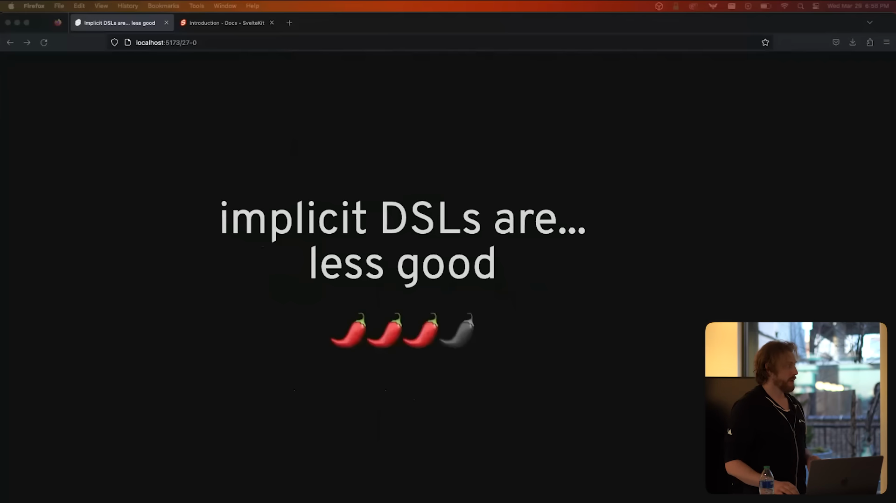

私はDSLに肯定的ですが、重要な注意点があります。
正直である必要があるのです。

Svelteの場合、.svelteファイルを使用しています。
.svelteファイルを開くと、通常のプログラミングのルールが一時的に中断されるような、ある種のLiminal Space^[現実空間と異空間の狭間のこと。[Liminal space (aesthetic)](<https://en.wikipedia.org/wiki/Liminal_space_(aesthetic)>)]に入ることになります。
こういった空間が嫌な人もいるでしょうが、それはそれでいいのです。
私たちのほとんどは、時には人生に魔法を感じたいと思うのではないでしょうか。

ここで、私にとって奇妙に感じることについて話していきます。
もし誰かがJavaScriptファイルの中でJavaScriptのセマンティクスを変え始めたら、私は逃げ出してしまうでしょう。
これは最近、さまざまなプロジェクトで繰り返されているテーマで、現在よりももう少し精査されてしかるべき現象だと私は考えています。

これについての例を示す前に、少し昔話をしましょう。
2015年のことですが、私はJavaScriptモジュールバンドラーのRollupに取り組んでいて、かなり賢いと思われるヒューリスティックを実装しました。
それは、もし、あるモジュールのimportを使用していない場合（たとえばD3 transitionに含まれる未使用のeaseやtransition）、Rollupはそれを単にモジュールグラフに追加せずに、破棄するという仕組みでした。
念の為に、逃げ道として、副作用のためにモジュールをモジュールグラフに追加する必要がある場合は、指定子なしでインポートを追加すればRollupがそれをバンドルに含めることができました。
私は若かったし、世間知らずだったので、これは本当に賢い最適化だと思いました。

同じ頃、D3コミュニティがMike Bostockにモジュールバンドラーを使うように説得し、彼はつまるところ、「了解。すべてをCommonJSで書き換えてBrowserifyを使うね」と言いました。
私はこれにぞっとしました。というのもこの変更はD3バンドルが遅くて大きくなることを意味していたからです。
そこで私は、2015年5月27日に彼にこのようにメールを送りました、「やあ、これにはJavaScriptモジュールを使うべきだと思うんだ。ツールはまだないんだけど、実は今その最適化に取り組んでるんだよね」と。
5月29日になると、彼はRollupのレポジトリでいくつか問題を報告し始めました。それは私が予想もしていなかったことで、少しばかり恐ろしかったです。先に述べた例はそのうちの1つです。
Mikeはとても親切で素晴らしい人なのでこんなことを言うとは思いませんが、つまるところ彼がこの問題について言いたいことは、「JavaScriptはそんな風には動かないよ、このバカ」、ということです。
実際彼は正しいのです。モジュールをグラフから削除することなく、コードのセマンティクスを根本的に変えることはできません。

時を少し進めましょう。
いくつかのフレームワークが「JavaScriptのセマンティクスを無視することは、単に問題ではなく、むしろフレームワークのコアなセールスポイントである」と判断しました。
ここではRemixを例に挙げますが、これは他のフレームワークにも見られます。
たとえばNext.jsでも、バージョン13でApp Routerが発表されるまでは似たようなことをしていました。

これはRemixのルーターです。
これは、データをロードするサーバー上のコードをViewのコードと一緒に書けると言うものです。
クライアントアプリがビルドされると、ローダーとそれに依存するものはtree-shaking^[[使われていないコードを削除すること](https://developer.mozilla.org/ja/docs/Glossary/Tree_shaking)]されます。
しかし、これは本物のtree-shakingではありません。これはでっち上げの、非標準のJavaScriptセマンティクスです。
「ちょっと待て生真面目Rich君、君はいつからJS界の学級委員になったんだい？」と思うかもしれません。
ですが、これは現実世界では大いに影響を与えるものです。

Remixのドキュメントには、このデザインで発生した問題を回避するためのページがあります。
現実的な影響とは別に、サーバーとクライアントの境界が曖昧になることが混乱のもとだと思います。

私は、「自分のコードが最終的にどこで実行されるのかまったくわからない」と複数の人が言っているのを聞いたことがあります。

さらに心配なのは、クライアントのバンドルにサーバーのコードが含まれてしまう可能性があることです。
Remixを考案したMichaelでさえ、これが現実的な問題であることを認めています。
ユーザーに提供するJavaScriptの中に、誤って機密性の高いものを入れてしまうというのは、寝不足でちょっと1度失敗をしただけでも起こりうることです。
また、たとえそのようなミスをしなかったとしても、本番環境のアプリをデバッグするためにソースマップを使用することは避けるべきです。なぜならソースマップにはデータベースクエリなどを含むモジュール全体が含まれているためです。

なぜ私は他のフレームワークの設計について話しているのでしょうか？
Remixを使うなと言っているわけではありません。
また、Remixチームが別の選択をするべきだとも言いません。
それは私の仕事ではありません。
しかし、しばしば人々は、「他のフレームワークがXをやっているので、SvelteKitも同じようにすべきではないか？」と言います。
そして、それが私の仕事になります。

この設計（訳注:サーバーとクライアントのコードを一緒に書くことができる設計）の理由は、関連するコードを共有することが便利だからです。
この「関連するコードを同居させる利点」を私はよく知っています。

私は、Vueや他の誰よりも、2014年にはすでにシングルファイルコンポーネントを使用していました。
私はこれが大好きです。

しかし、サーバークライアントの境界を越えるコードを単一のファイルに共有することはやりすぎでした。
現に、Svelteでプロトタイプを作ったのですが、筋があまり良くなかったのです。

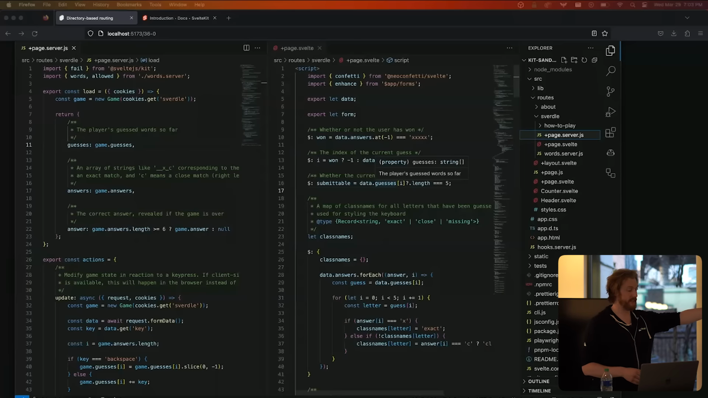

ですので、SvelteKitでは、ファイルではなくディレクトリに共有します。
これは、SvelteKitコードベースのスクリーンショットです。
SvelteKitアプリでは、各ディレクトリがルートであり、各ルートにはデータのロードに使用するサーバーコードと、サーバーとクライアントの両方で実行されるViewコードが含まれます。
これは、`npm create svelte`を実行したときに作られるデモアプリです。
`src/route`の中には`about`ルートと`sverdle`ルートがあり、これはJavaScriptなしで動作するWordleクローンです。
このSvelteクローンのページのサーバーコードは、左の`+page.server.js`に格納されています。
ファイル名に `.server`がついているファイルは、クライアントサイドのコードにインポートすることができません^[[Server-only modules • Docs • SvelteKit](https://kit.svelte.jp/docs/server-only-modules)]。ビルドに失敗します。
ディレクトリベースのルーティングは、Next.jsから盗んだものであり、その他のメリットがありますが、今は詳しく説明できません。
しかし、私は強くこれが正しい方法だと信じています。

ちょっとしたイースターエッグもあります。
この画面では、右側の`+page.svelte`の16行目のdata.guessesにカーソルを合わせていますが、そこには左側の`+page.server.js`の9行目に書いた型情報とInline Documentが表示されます。
つまり、ネットワーク全体で型安全性を保証しているのです。

これらは、強力な規約を採用することで可能になり、最悪の開発者体験とは程遠いものになります。
私は実際にこの方法が好ましいと思っています。

私はよく、データを読み込むサーバーのコードを一方に開き、ビューのコードをもう一方に開くことがあります。
スクリーンは広いが、ファイルは縦に長くなりがちです。
だから、1つのファイルにすべてを詰め込もうとするととても見辛くなります。

さて、もう1つ非標準的なセマンティックスの例をお見せしましょう。
このスライドは[Qwik](https://qwik.builder.io/)チームによるものです。
Qwikは、個々の関数を遅延ロードして、Lexical Scope^[参考: [僕らは JavaScript を知らない - レキシカルスコープとクロージャとガベージコレクション Lexical Scope, Closure and Garbage Collection](https://uraway.hatenablog.com/entry/2018/01/24/120000)]を再作成できるようにコードを変換するフレームワークです。
これはとても賢い方法であり、注目する価値があります。

私自身は、このようなものには少し抵抗があります。
たとえば、JSXのブロックからincrement関数を移動すると、アプリが壊れます。
通常のJavaScriptなら問題なく動きます。
でも、JavaScriptじゃないんです。
これはQwikです。
Qwikは実質的に、より細かいコード分割のためのDSLです。
同じ理由で、その関数内で参照する値については注意が必要です。なぜなら、Lexical Scopeを再現するために、フレームワークがそれをシリアライズする必要があるからです。

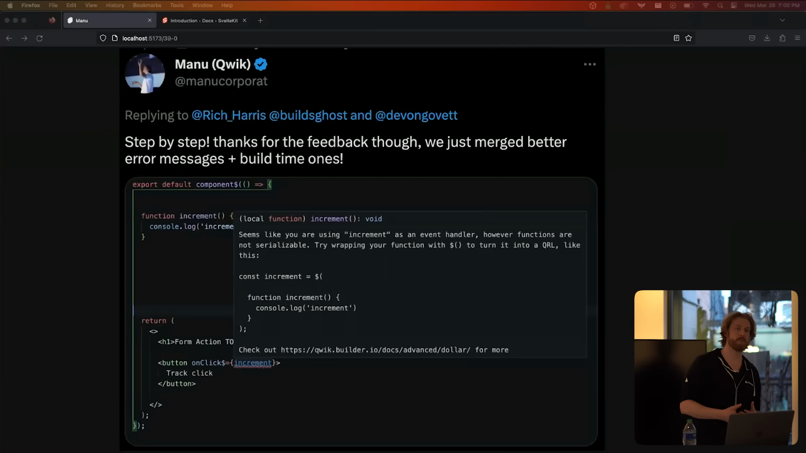

私はしばらく前にこれをTwitterで言及しました。
数時間後、QwikチームのManuは、問題を診断できるように、より役立つエラーメッセージを追加してくれました。
彼らは優れた専門知識を持ち、とても献身的ですね。

しかし、これは私が見ているより広範な傾向の1つの例にすぎません。JavaScriptまたはTypeScriptをうまく扱うためには、裏側で起こっている非常に洗練された高度な変換を理解する必要があります。
遅延ロードには他にも欠点があります。
私がよく行うような条件付きでイベントのデフォルトを防止することができないことが挙げられます。
これは、プログラミングモデル全体をオプトアウトしなければならないということです。
しかし根本的には、コードが何をするのかとコードがどのように見えるかとの間のミスマッチが、私の悩みの種なのです。

ここで試しにChatGPTにコンポーネントをリファクタリングしてもらいましたが、最初はReactのイディオムを適用しようとしました。
ここで`useState`は使えないと説明しました。
すると、ChatGPTはJavaScriptを扱っていると勘違いしてしまい、increment関数をJSXの外に出すという、先ほどとまったく同じミスを犯してしまいました。

今度は[Solid.js](https://www.solidjs.com/)の例です。
JSXとJavaScriptの理解に基づくと、これらの2つのコンポーネントが同じように動作するはずです。
しかし実際には全然違います。
Solid.jsをよくご存知な人なら、これは完全に理解できることでしょう。
でも、ここには明確な道標がありません。
したがって、5年後にこれらのコードベースをうまく保守できるようになるでしょうか？
わかりません。多分できるかもしれません。

これらのフレームワークは、どれも本当に面白くてクールなことをやっているので、非難するつもりはありません。
これらはとくに注目すべき例です。
そして、彼らは同じように、Svelteのプログラミングモデルのいくつかの要素はあまり好ましくないと考えています。
また、私はあなたにどう思えというわけではありません。
これらのフレームワークで遊んでみて、自分なりの意見を持つことをオススメします。
私はただ、私の考えをお伝えしているだけです。
私が言いたいのは、あなたの科学者たちは、「できること」に気を取られていて、「すべきこと」について考え、立ち止まることをしなかったのだと思います。

# コードはユーザーに近い場所で実行すべきです [Code should run close to the user] (🌶🌶)

原文

Okay.
This doesn't feel like it should be a particularly spicy take, but it does have some moderately spicy implications.
Other things being equal, code should run as close to the user as possible.
So the edge is better than a central server, but on device is better than the edge.
Now other things are not always equal.
Sometimes you need to access your database, in which case your code should run near your database.
And sometimes you need to have access to sensitive information that can't be exposed to the client.
But there's a lot of stuff that doesn't fall into that category.
For example, if I add a product to my shopping cart, I should be able to see that reflected immediately.
Another example that we're all familiar with.
When you're writing a comment in GitHub, you can't preview it without sending the comment to the server so that it can render the markdown.
Sometimes it's pretty slow.
You can absolutely do markdown rendering and syntax highlighting in the browser.
Maybe you don't want to be lazy about loading the grammars that you use for the syntax highlighting,
but it is a very solvable problem and it will provide a much nicer user experience.
And this isn't just about latency.
It's also about resilience.
I travel by Amtrak a fair bit and every time I do, I'm like, great, three hours of uninterrupted work.
But then I keep running into things like that because my connection is so flaky and most times I'll just give up and read a book instead.
This is not just Amtrak.
It's also every time I'm on the subway or even when I'm walking down the stairs to leave my flat and my phone switches from Wi-Fi to cellular, just as I'm trying to look at the details of where I'm supposed to be going.
Turns out we're pretty bad at building things in an offline first way at the best of times.
All of this is why I'm personally a little bit nervous about React server components.
For those of you who aren't aware, RSC means that your UI is rendered on the server by default and only components that have a special `use client` directive will run in the browser and have access to things like `useState` and `useEffect`.
Server components and client components have different APIs, they can use different hooks and there are restrictions on how you can combine them, but the upshot is that by default in the future, your React app will run entirely on the server and you will opt in to client rendering for specific parts of your app.
Now clearly this has some very substantial benefits.
This is hugely important work and frankly it blows my mind, but I do worry that we'll become so paranoid about serving JavaScript to our users that we'll overcorrect.
If the default interaction is to require a server round trip, for client components to be implicitly regarded as something to avoid, then the net result could be slower and less resilient web apps.
I might just be fair mongering here, I don't know.
Dan Abramov is probably going to do a withering tweet thread on why I'm wrong about this, but I'm very curious to see how this is all going to look in a couple of years with the benefit of hindsight.

さて、次は特段スパイシーではないでしょうが、少々辛辣ですね。
他の条件が同じであれば、コードは可能な限りユーザーに近い場所で実行すべきです。
つまり、中央のサーバーよりもエッジの方がいいし、エッジよりもデバイスの方がいいのです。

しかし、それも場合によります。
場合によっては、データベースにアクセスする必要があるため、コードはデータベースの近くで実行する必要があります。
そして、クライアントに公開できない機密情報へのアクセスが必要な場合もあります。
しかし、そのカテゴリに当てはまらないものもあります。

たとえば、ショッピングカートに商品を入れたら、その反映をすぐに確認できるようにしたいですよね。
もうひとつ、私たちがよく知っている例を挙げます。
GitHubでコメントを書いているときに、コメントをサーバーに送信してmarkdownをレンダリングするまで、それをプレビューすることはできません。
時にはかなり遅いこともあります。
ブラウザでマークダウンのレンダリングやシンタックスハイライトを行うことは絶対にできます。
あなたはシンタックスハイライトのロードを待ちたくないかもしれませんが、これは解決可能な問題であり、結果としてより良いユーザーエクスペリエンスを提供します。

また、これはレイテンシーの問題だけではありません。
レジリエンス（回復力）の問題でもあるのです。
私はよくAmtrakで移動します。私はそのたびに、「いいね、3時間連続で作業ができる」と思っているのですが、接続が不安定なために大抵は仕事を諦めて本を読むことになります。
これはAmtrakだけの問題ではありません。地下鉄に乗っているときや、自宅を出て階段を降りるときに、私の電話がWi-Fiからセルラーに切り替わってしまい、行き先の詳細を見ようとしている最中に接続が切れてしまうこともあります。
結局、私たちはOffline Firstな方法で物を構築するのにあまりにも下手なようです。

これらを踏まえて、私は個人的に[React Server Components(RSC)](https://nextjs.org/docs/advanced-features/react-18/server-components)について少し心配しています。
RSCとは、UIがデフォルトでサーバー上でレンダリングされ、特別な`use client`ディレクティブを持つコンポーネントのみがブラウザー上で実行され、`useState`や`useEffect`などにアクセスできることを意味します。
Server ComponentとClient Componentは異なるAPIを持ち、異なるフックを使用することができ、それらを組み合わせる方法に制限がありますが、要約すると、将来的にはReactアプリケーション全体がサーバー上で実行され、アプリケーションの特定の部分に対してのみクライアント・レンダリングがオプトインされることになります。
これは明らかに、非常に大きなメリットがありますし、率直にいってとてもワクワクしています。
しかし、これによって私たちはユーザーにJavaScriptを提供することに対して過剰に慎重になりすぎる可能性があると心配しています。

もし、デフォルトのインタラクションが、サーバーのラウンドトリップを必要とし、クライアントコンポーネントが暗黙のうちに避けるべきものとみなされるならば、結果的により遅く、より回復力のないウェブアプリケーションを生み出す可能性があります。

私はここで不安を煽っているだけかもしれませんが、私はわかりません。
Dan Abramovは、私が間違っている理由について鋭いツイートスレッド投稿するかもしれませんが、これらすべてが数年後にどのようになるかは楽しみです。

# RPCを再発明することを後悔することになる [We will regret reinventing RPC] (🌶🌶🌶)

原文

Okay, another spicy to take, we will regret reinventing RPC.
RPC stands for Remote Procedure Call, it's an idea that has been around since the 70s.
Basically what it means is that instead of passing a message to a server and waiting for a response, you call a function on the server instead and the RPC protocol takes care of the actual message passing.
In effect, it allows you to pretend that a distributed system is not distributed, you're just calling functions.
Back in the 80s, people were calling the wisdom of this idea into question.
This 1988 paper by Andrew Tannenbaum called A Critique of the Remote Procedure Call Paradigm is very much of its time, but it's still worth reading.
Some arguments can't be serialized correctly, serializing closures is particularly hairy.
If the server mutates arguments, that mutation won't be respected on the client.
Network errors and logic errors all kind of get smushed together.
All of these things are easy to deal with if you're not hiding the implementation details.
But over the past few months, RPC has had a bit of a renaissance in the front-end world, except that we now call it server functions.
I first saw it in `Solid Start`.
The idea is that you write code like this, and oh, hang on, they write code like this.
I'm going to have to try and remember my slides because I messed this up.
And the compiler sort of waves a magic wand and you can call code on your server as though it were a local function.
And so the ergonomics of this are undeniably really nice.
You even get type safety because as far as TypeScript is concerned, it is just a local function.
But a while back, Jason Miller, the creator of PReact, did a tweet that I found quite interesting.
He said, in effect, that these abstractions are dangerous.
I hope he's wrong, but I think he might be right.
I can retell you this example here.
This server function looks and feels like an internal implementation detail, but it's not.
We've actually made an HTTP endpoint that anyone can call with any data.
So TypeScript is telling us that fields can be name or quantity, but in reality, it could be `NAME; DROP TABLE "USERS"`
If you know, you know.
So when you make an endpoint explicit and you're working with full data, you're aware on some level that the data is untrusted.
And so, you know, I think you're much less likely to make this sort of error than if it looks like a private function call.
And you might be thinking, Rich, come on, I would never make that mistake.
But look to your left and look to your right at the people around you.
Do you trust them not to make that mistake?
I don't know.
Bear in mind also that if you use source maps for debugging and they contain the original server code, you're basically handing attackers a diagram of your defenses.
This shit makes me very nervous.
So people have asked us to add this to Sveltekit, and we've said no.
Maybe one day, once enough people have fucked around and found out, we'll do it.
But not yet.
We think that part of our responsibility as toolmakers is to the extent that we're able to help protect you and your users against these sorts of issues.
So Sveltekit has built-in CSRF protection, it has CSP primitives, and we don't do things like that just because they feel convenient.

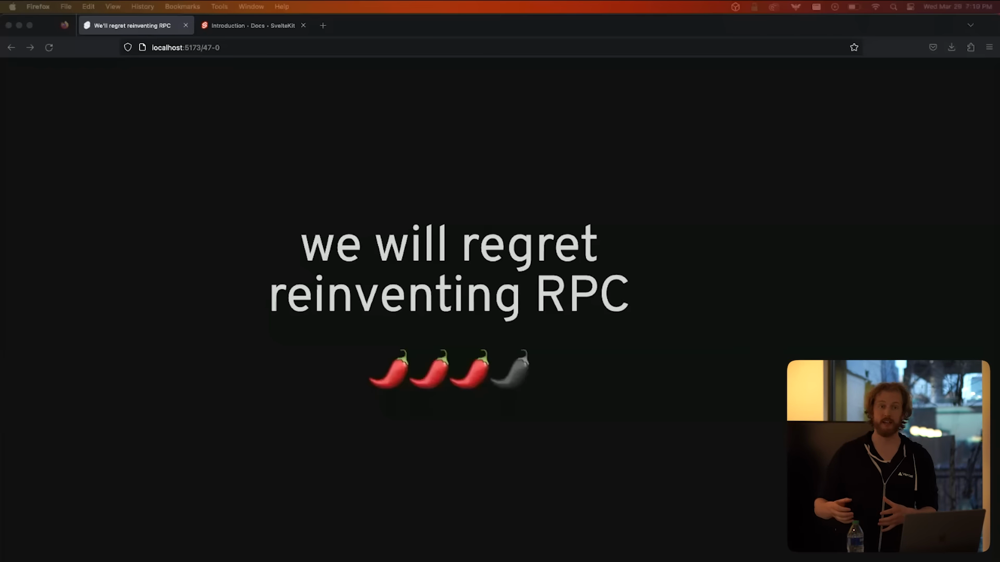

さて、もう1つの刺激的な話題ですが、私たちはRPCを再発明することを後悔するでしょう。
RPCとはRemote Procedure Callの略で、70年代からあるアイデアです。
基本的には、サーバーにメッセージを渡して応答を待つ代わりに、サーバー上の関数を呼び出し、RPCプロトコルが実際のメッセージのやり取りを処理します。

これを使うと、分散システムをあたかも分散していないように扱うことができます。
単に関数を呼び出せば良いのです。
80年代には、人々はこのアイデアの賢明さに疑問を呈していました。
Andrew Tanenbaumの1988年の論文「[A Critique of the Remote Procedure Call Paradigm](https://www.cs.vu.nl/~ast/Publications/Papers/euteco-1988.pdf)」はかなり昔の論文ですが、今でも読む価値があります。

RPCでは一部の引数は正しくシリアライズできず、クロージャのシリアライズは特に厄介です。
サーバーが引数を変更した場合でも、その変更はクライアント側では尊重されません。
ネットワークエラーやロジックエラーなどがすべて混在してしまいます。
これらのことは、実装の詳細を隠さないのであれば、簡単に対処できます。

直近の数か月間で、RPCはフロントエンドの世界で再び注目されるようになりました。**サーバー関数**と呼ばれるものです。
私は最初に[Solid Start](https://start.solidjs.com/getting-started/what-is-solidstart)でそれを見ました。
そして、コンパイラが魔法の杖を振りかざすと、サーバー上のコードをあたかもローカル関数のように呼び出すことができます。
人間工学的に非常に優れていますね。
TypeScriptに関しては、ローカル関数であるかのように扱われるため、型安全性さえ得られます。

しかし、数か月前、PReactの作者であるJason Millerは、かなり興味深いツイートをしました。
彼は、事実上、これらの抽象化は危険であると述べました。
彼が間違っていることを願っていますが、彼が正しいかもしれません。

この例を再度説明します。
このサーバー関数は内部の実装のように見えますが、実際にはそうではありません。
誰でも任意のデータでHTTPエンドポイントを呼び出せるようになっています。
TypeScriptは、フィールドが`name`または`qty`であることを示していますが、実際には`NAME; DROP TABLE "USERS"`である可能性もあります。
お分かりだった方もいらっしゃいますよね？

対して、明示的にエンドポイントを設計し、完全なデータを扱うならば、受信するデータが信頼できないものであることをある程度認識していることになります。
またもしそれが非公開の関数呼び出しだったとしても、この種のエラーを作る可能性がずっと低いと思います。

「おいおいRich、俺はそんなミスはしないぞ」と思うかもしれません。
しかし、左を見て、右を見て、あなたの周りの人たちを見てください。
その人たちがこのような間違いをしないと信じているのでしょうか？
私にはわかりません。

また、デバッグのためにソースマップを使用し、そのソースマップにオリジナルのサーバーコードが含まれている場合、基本的に攻撃者に防御の図を渡していることになることも念頭に置いておいてください。
私はとても不安になります。
だから、Sveltekitにこの機能を追加してほしいという要望がありますが、私たちの答えは「ノー」です。
もしかしたら、十分に多くの人々が試行錯誤した結果いつか実装するかもしれません。
しかし、まだです。
ツールメーカーとしての私たちの責任の一部は、この種の問題に対してあなたとあなたのユーザーを保護するためにできる限りのことをすることです。
Sveltekitには、組み込みのCSRF保護があり、CSPプリミティブがあります。
私たちは「ただ便利だから」という理由で動いてはいないのです。

# ビルドステップは良いゾ [Build steps are good] (🌶)

原文

Again, I'm rating this one low on the Scoville scale, even though it seems like an unpopular opinion, because I think it's actually pretty obvious.
Build steps are good.
This idea that comes up every now and again in front-end, that build tools are the devil's work and that we would all be much better off without them.
This is a recent example that gained some traction from the Deno blog, and it's one of the better versions of this argument that I've seen.
Normally they're a lot angrier, but the thing that often gets missed in discussions about build steps is that they primarily exist for a user's benefit, not for ours.
Build steps let us minify code, they let us combine 100 small modules into 10 core screen chunks that load faster, they remove unused code from client-side bundles, they optimize images, they hash assets so that they can be cached immutably, they guard against bugs by type-checking and linting.
This is all stuff that directly results in a better user experience.
It's true that build steps also benefit developers by letting us use non-standard dialects, easily import dependencies and things like that, but if you remove build steps, a user experience that suffers more than developer experience.
And yet, interestingly, if you look at the people who complain most vociferously that our industry prizes DX over UX, and then look at the people who want to get rid of build tooling, there is a striking overlap.
It's hard not to conclude that it comes more from a reflexively anti-tooling mindset than a genuine concern for users.
Here's another example of a build step being really beneficial that I didn't get around to doing a slide for.
And all of the code snippets in SvelteKit's documentation are type-checked against the SvelteKit source code.
So for example, this code down here is checked at deploy time to make sure that it doesn't contain any errors and that it's up to date with current types in SvelteKit itself.
And that unavoidably takes time.
One of these pages might take several seconds to render on this M1 MacBook Pro.
So we pre-render this content at build time, as well as ensuring that we don't publish incorrect documentation, because if we do, the deployment will fail.
It means that everyone visiting this site gets content instantly.
If we did that rendering on demand instead, then even if we had incredibly sophisticated caching, some users would end up having to wait multiple seconds for the page to load, and that is just not acceptable.
So build steps.
You might not need one, but you should probably have one anyway.

さて、次の意見はスコヴィル値^[辛さの単位: [スコヴィル値](https://ja.wikipedia.org/wiki/%E3%82%B9%E3%82%B3%E3%83%B4%E3%82%A3%E3%83%AB%E5%80%A4)]を低めにしています。
なぜなら私はこの意見はあまり世間で受け入れられていないにもかかわらず、実は結構当たり前のことだと思うからです。

**ビルドステップが非常に重要です。**

ビルドツールは悪魔の所業であり、ビルドツールがない方がずっと良いという考え方は、フロントエンドで時々出てきます。
最近の例では、Denoブログから広がった議論がありますが、これは私が見た中でもかなり優れた議論の1つです。
通常、彼らはもっと怒っていますが、ビルドステップについての議論でしばしば見落とされるのは、ビルドステップは主にユーザーの利益のために存在するのであって、私たちのために存在するのではないということです。

ビルドステップはコードを最小化し、100個の小さなモジュールを10個のコアスクリーンの塊にまとめ、より高速に読み込めるようにします。
また、クライアント側のバンドルから未使用のコードを削除したり、画像を最適化したり、アセットをハッシュ化してキャッシュできるようにします。
Type CheckやLintによってバグを防止することもできます。
これらはすべて、より良いユーザーエクスペリエンスに直接つながるものです。

確かにビルドステップは、非標準の方言を使ったり依存関係を簡単にインポートできたりと、開発者にもメリットがあります。
しかし、ビルドステップを削除すると、開発者の経験よりもユーザーの経験の方が損なわれます。

興味深いことに、私たちの業界がUXよりもDXを重視していると大きな声で叫んでいる層と、ビルドツールの廃止を望む層は、見事に重なっています。
これは、ユーザーに対する純粋な関心というよりも、反射的に反ツール化のマインドセットから来ていると結論づけざるを得ません。

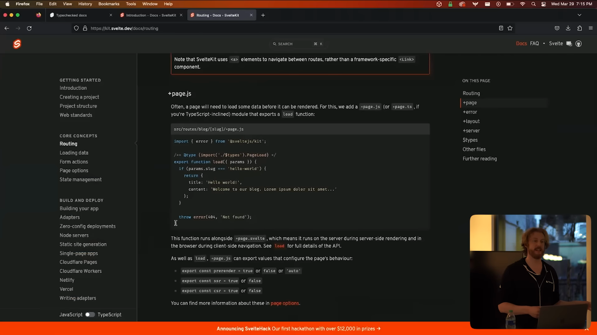

もう1つ、ビルドステップが本当に有益である例を紹介します。
SvelteKitのドキュメンテーション内のすべてのコードスニペットは、SvelteKitのソースコードに対して型チェックが行われています。

たとえば、このページにあるコードはデプロイ時にエラーがないか、SvelteKit自体の型が最新かどうかチェックされます。
そのため、デプロイにはどうしても時間がかかってしまいます。
このM1 MacBook Proでは、1ページのレンダリングに数秒かかることもあります。
それでも、このコンテンツをビルド時に事前にレンダリングし、不正確なドキュメントを公開しないようにすることで、サイトを訪問する人全員が瞬時にコンテンツを取得できるようにしています。
もしオンデマンドでレンダリングを行った場合、キャッシングを頑張ったとしても、ページの読み込みに何秒も待たされるユーザーが出てくることになります。
ですので、ビルドステップは必要がないかもしれませんが、それでもおそらく必要です。

# ぶっちゃけどうでもいい [None of this matters] (🌶🌶🌶🌶)

原文

Okay, my final take of the evening is that none of this matters.
I don't think AI is going to take all our jobs, but I do think there's a better than even chance that it is going to change them beyond all recognition.
Might not be long before talking about these sorts of code preferences feel like talking about what implement you want to use to make holes in your punch cards.
So for the few weeks in which any of this is still relevant, let's have interesting debates and share our ideas, but let's not take ourselves too seriously.
And let's have fun building stuff whatever we like to build stuff!
That is my time.
Thank you for hearing me.

**さて、今夜私が最後に言いたいことは、「ぶっちゃけこんなのはどうでも良い！」です。**

私は、AIが全ての仕事を奪うとは思いませんが、AIが私たちの仕事をガラリと変えてしまう可能性は十二分にある、と考えています。

なので、この種のコード環境について話すことが、パンチカードに穴をあけるためにどんな道具を使うかについて話すような感じになるのも、そう遠くないかもしれないですね。
ですから、このAIブームの数週間、面白い議論をして、アイデアを共有して下さい。
あまり思い詰めないでください。

ものづくりを楽しもう！

ご清聴ありがとうございました。
