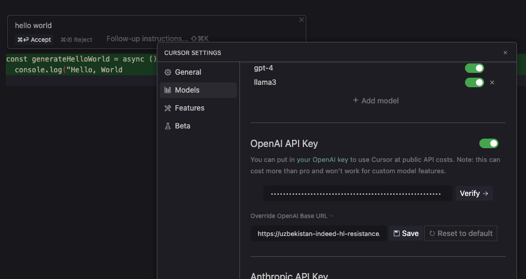

# はじめに

Cursor Editorすごいですよね！
ChatGPTとの連携が強力で、コーディングの体験がとても良いです。

https://cursor.sh/

また、昨今ではChatGPT対抗のLocal LLMの開発も盛んです。
特にOllamaを使うと、Local LLMをとても簡単に使うことができます。

https://ollama.com/

最近では

- Command R
- Command R+
- Llama3

など、一部GPT-4を超える性能を持つモデルも登場しています。

Local LLMの魅力はなんといってもその種類の豊富さ、そして無料で使えることです。

しかし、Cursor EditorではそのままではOllamaを使うことができません。

## CursorでOpenAI以外のLLM Providerを使うには

そもそもCursor Editorは以下のProviderに対応しています。

- OpenAI
- Claude
- Azure OpenAI

しかし、世の中にはOpenAI互換のAPIというものが存在します。
これらのAPIを呼び出す仕組みがCursor Editorには用意されています。それがEndpointの変更です。


_Cursor EditorのModel設定画面 Endpointを変更することで、OpenAI以外のLLM Providerを使うことができる_

そのため、各社のモデルをOpenAI API互換に変換して提供してくれるサービスがあったりします。

https://OpenRouter.ai

こういったサービスを使うと、例えばCohere社の[Command R+](https://docs.cohere.com/docs/command-r-plus)をCursor Editorで呼び出せたりできます。

https://mosya.dev/blog/cursor-commandr

ところで、OllamaはOpenAI API互換のAPIを提供しています。

https://ollama.com/blog/openai-compatibility

では、ここにOllamaのendpointである`http://localhost:11434/v1`を指定してみましょう。

すると....エラーが出ますね。
なぜでしょう....?

## なぜCursorでOllamaを使えないのか


_Cursor EditorでDeveloper Toolを開いてみる_

結論から言うと、CursorでLLMを呼び出す時は以下の経路でリクエストが送られます。

```
Cursor Editor
↓
Cursor Server
↓
LLM Provider(OpenAI etc.)
↓
Cursor Server
↓
Cursor Editor
```

Cursor EditorからCursor Serverに送られるリクエストの中には、Endpointの情報も含まれています。
そして、Cursor Serverはその情報を元に、リクエストをLLM Providerに送ります。

そのため、`localhost`を指定しちゃうと、Cursor Serverから通信がこないんですねえ。

なのでlocalのollama serverを公開して、Proxyする必要があるのですね。

## 一番簡単な解決策

一番簡単なのは、ollamaのエンドポイントを`ngrok`なり`cloudflared`で公開しちゃうことです。

https://github.com/ollama/ollama/blob/main/docs/faq.md#how-can-i-use-ollama-with-ngrok

これで得られたURLをCursor EditorのModel設定画面に入力すれば、Ollamaを使うことができます。

しかし、この方法には大きな問題があります。
それは、OpenAIのサーバーに接続できなくなる、という致命的な問題です。

いちいち設定画面に行ってEndpointを都度変更するのは面倒ですよね。

## Proxy Server作った

そこで、Proxy Serverを作りました。
https://github.com/ryoppippi/proxy-worker-for-cursor-with-ollama

コードも簡単なんで全部載せちゃいます。

https://github.com/ryoppippi/proxy-worker-for-cursor-with-ollama/blob/a3fac9a07706f64e16f67882369ebea568027e37/main.ts

簡単にProxy Serverを立てるならHonoとDenoを使うというのは常識（？）ですね。

- Deno: 依存関係インストールも一瞬、テストもlinterもfmtもすぐ動く。urlからfileを取得してすぐ実行できて便利
- Hono: 簡単にサーバーがかける。説明不要

使うには

```sh
deno run -A https://raw.githubusercontent.com/ryoppippi/proxy-worker-for-cursor-with-ollama/main/main.ts
```

でサーバーが立ち上がります。

あとは、`cloudflared`が発行してくれるURLに`/v1`をつけたものをCursor Editorの`OpenAI API Key -> Endpoint`に入力し、`Model Names`に使いたいモデルの名前を追加すれば、任意のOllamaで動くモデルを使うことができます。



(また、このProxy Serverに念の為にアクセス制限をしたい人は、環境変数に`OPENAI_API_KEY`を設定すると、キーでアクセス制限をかけてくれます。)

## Future Works

- Perplexity AIもOpenAI API互換なので、対応してもいいかも
- Honoと聞いたらもちろん、Cloudflare Workers AIに対応してみるのもおもしろそう。ただ、OpenAI API互換ではないのでちょっとゴニョゴニョする必要がある、かも。
