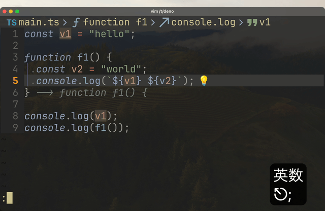

> [!NOTE]
> この記事は[Vim 駅伝](https://vim-jp.org/ekiden/)の 4/19 の記事です。

# はじめに

VSCode などのテキストエディタには、マルチカーソルという機能があります。
これは、エディタ上に複数のカーソルを出現させ、一度に複数の場所に同じ操作を行うことができる機能です。


_VSCode上でのマルチカーソル_

自分はVSCodeをメインとしていた時にはこの機能を多用していたのですが、Neovimに移行してから一切使っていません。

一応Vim/Neovimにもマルチカーソルを実現するプラグインがいくつか存在します。
ですが、一度は入れてみるものの結局使わないままアンインストールしてしまいました。

https://github.com/terryma/vim-multiple-cursors
https://github.com/mg979/vim-visual-multi
https://github.com/brenton-leighton/multiple-cursors.nvim

ではなぜ、マルチカーソルが必要なくなったのか。
それはVim/Neovimの操作体系/機能が十分に強力であるので、マルチカーソルを使わなくても同じことができるからです。

この記事では、自分がVSCodeのマルチカーソルで行っていた操作をVim/Neovimの操作体系/機能でどのように行っているかを紹介します。

# 行の先頭に文字を追加する

例えば以下のようなテキストがあるとします。

```text
foo
bar
baz
```

例えばこのテキストの行頭に`1. `を追加したいとします。

```text
1. foo
1. bar
1. baz
```

この時、VimではVisual Blockモードを使うことで簡単に行うことができます。

0. `0`または`^`で行頭に移動する
1. `Ctrl-v`でVisual Blockモードに入る
2. `j`や`k`で追加したい行を選択する
3. `I`で挿入モードに入る
4. 追加したい文字列を入力する
5. `Esc`で挿入モードを抜ける


_Visual Blockモードを使って行の先頭に文字を追加する_

# 行の末尾に文字を追加する

行の末尾に文字を追加する場合もVisual Blockモードを使うことで簡単に行うことができます。

0. `Ctrl-v`でVisual Blockモードに入る
1. `j`や`k`で追加したい行を選択する
2. `$`で行末に移動する
3. `A`で挿入モードに入る
4. 追加したい文字列を入力する


_Visual Blockモードを使って行の末尾に文字を追加する_

# 追記: Visual Blockモードを使って数字をインクリメントする

> [!NOTE]
> この章は[@tani](https://github.com/tani)さんにリマインドしていただき、追記しました。

Visual Blockモードを使うと、数字をインクリメントすることも簡単に行うことができます。
例えば

```text
1. foo
1. bar
1. baz
```

この時、Visual Blockモードで数字を選択し、 `<Ctrl-a>`/`<Ctrl-x>`を押すことで、数字を一気にインクリメント/デクリメントすることができます。

```text
2. foo
2. bar
2. baz
```

もちろん一気に増やしたい時は、`20<Ctrl-a>`のように数字を指定することもできます。

さらに、`g<Ctrl-a>`/`g<Ctrl-x>`を使うことで、連番でインクリメント/デクリメントすることもできます。

この場合、数字を選択してから`g<Ctrl-a>`を押すことで、

```text
1. foo
2. bar
3. baz
```

のように数字をインクリメントすることができます。

<details>
<summary>dial.nvimについて</summary>

さらに、Neovimのプラグインである`dial.nvim`を使うことで、色々な形式の数字をインクリメント/デクリメントすることができます。

```text
2024-12-29 hello
2024-12-29 hello
2024-12-29 hello
2024-12-29 hello
2024-12-29 hello

この日付をVisual Blockモードで選択して、`g<Ctrl-a>`を押すと

2024-12-29 hello
2024-12-30 hello
2024-12-31 hello
2025-01-01 hello
2025-01-02 hello

こうなる
```

https://github.com/monaqa/dial.nvim

</details>

# カーソル下の単語の編集

Vimでは`*`を用いるとカーソル下の単語を前方検索することができます。
また、`gn`を用いると前方検索&ビジュアル選択を行うことができます。
さらに、`cgn`を用いると前方検索&ビジュアル選択&変更を行うことができます。

ところで、vimにはドットリピートという機能があり、直前の変更を繰り返すことができます^[[ここ](https://qiita.com/Kta-M/items/d8fbded37ad3140cfeb0)や[ここ](https://www.vikasraj.dev/blog/vim-dot-repeat)参照]。
これを使うと、直前の変更を繰り返すことができるので、繰り返し置換が簡単に行えます。

これらを組み合わせると、以下の操作でカーソル下の単語を繰り返し置換することができます。

0. `*`でカーソル下の単語を検索
1. `''`で元の位置に戻る^[[''もしくは``で直前のジャンプ位置に戻る](https://vim-jp.org/vimdoc-ja/motion.html#'')]
2. `cgn`で単語を編集
3. `n`で次の検索結果へ移動
4. `.`で単語の置換を繰り返す(いわゆるドットリピート)


_カーソル下の単語を繰り返し置換_

このような操作を毎回行ってもいいのですが、いい感じにkeymapを設定してしまうと便利です。

```lua
vim.keymap.set("n", "<leader>*", "*''cgn")
```

<details>
<summary>*の挙動についての補足</summary>

標準の`*`や`#`では、現在のカーソルの位置から前方検索を行って次の検索結果にジャンプします。
そのため本文中にある通り`*`で検索を行った後に`''`で元の位置に戻る必要があります。
もしカーソルを移動したくない場合は`vim-asterisk`のようなプラグインを使うと便利です。

https://github.com/haya14busa/vim-asterisk

</details>

# LSPを用いて変数を一括変更する

Neovimの組み込みのLanguage Server Protocol(LSP)クライアントを用いることで、変数名の一括変更を行うことができます。

```
:lua vim.lsp.buf.rename()
```


_LSPを用いて変数を一括変更する_

また `inc-rename.nvim`を用いると、変更中にプレビューが表示されるようになります。
https://github.com/smjonas/inc-rename.nvim

# Buffer全体で単語を一括変換する

Vimには便利な置換コマンドが用意されています。
例えば、`:s/foo/bar/g` でBuffer全体で`foo`を`bar`に置換することができます。

これを利用して、自分は選択した範囲から置換コマンドを一発で呼び出せるkeymapを設定しています。

```lua
vim.keymap.set("x", "<leader>r", 'y:%s/<C-r><C-r>"//g<Left><Left>')
vim.keymap.set("n", "<leader>r", 'yiw:%s/<C-r><C-r>"//g<Left><Left>')
```

このコマンドのやっていることは以下の通りです。

0. `y`で選択範囲をヤンク
1. `:%s//g`でBuffer全体に対して置換コマンドを開始
2. `<C-r><C-r>"`でヤンクした内容をペースト^[[<C-r><C-r>](https://vim-jp.org/vimdoc-ja/insert.html#i_CTRL-R_CTRL-R)]
3. `<Left><Left>`で最初の`//`の間にカーソルを移動


_選択範囲から置換コマンドを一発で呼び出す_

# より複雑な操作

ではもっと複雑な操作を考えてみましょう。
例えば、以下のようなテキストがあるとします。

```text
foo
bar
baz
hoge
fuga
```

このテキストを以下のように変更したいとします。

```text
[foo](https://example.com/foo)
[bar](https://example.com/bar)
[baz](https://example.com/baz)
[hoge](https://example.com/hoge)
[fuga](https://example.com/fuga)
```

このような操作はVisual Blockで一発で行うことは難しいです。
移動が伴うために、挿入モードで一発で行うことができず、ドットリピートも難しいです。

このような場合に使えるのがマクロです。
マクロは、複数の操作を記録して再生することができる機能です。

この場合だと以下のようなマクロを記録して再生することで簡単に変換することができます。

0. 最初の行に移動
1. `qq`で`q`レジスタへのマクロの記録を開始
2. 最初の行の編集を行う^[ この場合だと`0yiwI[<esc>A](https://example.com/<C-o>p)<esc>j` ]
3. `q`でマクロの記録を終了
4. `4@q`でマクロを4回繰り返す(Neovimなら`4Q`でもOK)


_マクロを使って複雑な操作を行う_

---

先の場合では、繰り返し回数を指定することで置換を行いましたが、他にもマクロの適用方法はあります。

例えば、`g`コマンドを使うことで、特定のパターンにマッチする行に対してマクロを適用することができます。

```
:g/foo/normal @q
```

このコマンドは、`foo`という文字列を含む行全てに対してマクロ`q`を適用します。

検索結果に対して個別にマクロを適用したい時もあるかもしれませんね。
その場合は、先に述べた`*`&`gn`を使って一個ずつ`@q`でマクロを適用していくことができます。
(もちろん適用したい行まで`j`や`k`で移動してもOK)

また行単位に限らず、Visualモードに入って

```
:'<,'>normal @q
```

を実行することで任意の選択範囲に対してマクロを適用することができます。

# AIを使う

「Vimの操作覚えるのとかめんどくせえよ、そんなことちまちまやってられっかよ」という方にはAIを使う方法がおすすめです。

https://github.com/github/copilot.vim
https://github.com/zbirenbaum/copilot.lua


_GitHub Copilotを使ってコードを生成する_

# まとめ

- VSCodeなどのマルチカーソル機能は便利だが、Vim/Neovimの操作体系/機能で代替できる
- Visual Blockモード/マクロ/LSP/置換コマンドなどを使うことでマルチカーソルで行っていた編集をカバーできる
- AIは正義

<details>
<summary>おまけ</summary>

Neovim向けにEmacsでお馴染みのdmacroが実装されつつあるらしい...?
https://github.com/tani/dmacro.nvim

</details>
