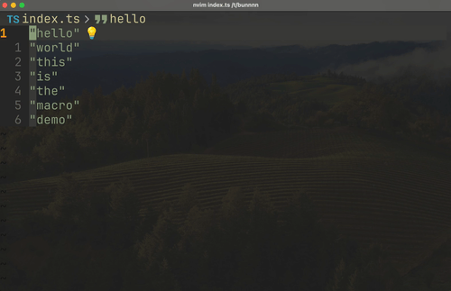

<!-- spellchecker:off -->

> [!NOTE]
> この記事は[Vim 駅伝](https://vim-jp.org/ekiden/)の 5/1 の記事です。

# TL;DR

_マクロ記録中にColorSchemeが変わっている様子_

# はじめに

Neovimの設定として、欠かせない（？）ものの一つがStatuslineです。
Statuslineとは、エディタの下部に表示されているBarのことです。

Neovim向けに有名なものだと、lualine.nvimやheirline.nvimがあります
https://github.com/nvim-lualine/lualine.nvim
https://github.com/rebelot/heirline.nvim
https://zenn.dev/kyoh86/articles/681ab90a44302c

さて、 自分のNeovimの設定ではStatuslineを非表示にしています。
これは、常に表示しておきたい情報というのは実はそんなにないだろうという考えからです。
必要な情報は必要な時に表示をすれば良いのです。
むしろその一行分画面が広くなり、画面のノイズも減るので嬉しいのです。

_自分のNeovimのScreenShot_

余談ですが、Statuslineに加えてCmdlineも非表示にしています。
こちらの話はShougoさんの記事に詳しく書いてあります。

https://zenn.dev/shougo/articles/set-cmdheight-0

さらにいえば`showmode`もオフにしています。
これは、vimの下部に表示されるmodeの情報を非表示にするためです。

以上の設定により、画面下部に表示される情報はほぼなくなりました。

https://vim-jp.org/vimdoc-ja/options.html#'showmode'

# StatuslinelineやCmdlineを補うプラグインたち

StatuslineやCmdlineを非表示にしていると、その代わりに何かしらの情報を表示するプラグインが必要になります。
自分の設定では、以下のプラグインを使っています。

- [modes.nvim](https://github.com/mvllow/modes.nvim) - カーソルの色をモードに応じて変更する。これでvimの下部に表示されるmodeの情報を補っています。
<!-- spellchecker:disable-line -->
- [noice.nvim](https://github.com/folke/noice.nvim) - Cmdlineを画面中央にpopupで表示する。これでCmdlineの情報を補っています。また、messageの表示も通知のようにふわっと表示させることにしています。 
- [dropbar.nvim](https://github.com/Bekaboo/dropbar.nvim) - window上部の`winbar`にカーソルの位置の情報を表示する。ファイル名、メソッド名などの情報を表示しています。

# 足りないもの、マクロ記録中かの判断材料

しかし、これらのプラグインでは足りないものがあります。
それは、マクロ記録中かどうかの情報です。

もしも`showmode`がオンになっている場合、マクロ記録中かどうかは`-- (recording@)`という文字列が表示されます。
しかし、`showmode`がオフの場合、この情報は表示されません。

<!-- spellchecker:disable-line -->

一応`noice.nvim`の設定で記録開始時に`-- (recording@)`という文字列を通知として一瞬表示させることはできますが、画面にずっと残して置くことはできなません。

自分は度々マクロを記録するのですが、しばしばマクロの記録が暴発してしまい、今は記録中なのか、記録中ならばどのレジスタに記録しているのか、という情報が欲しいと思っていました。

# ColorSchemeを変更するという選択肢

ColorSchemeを自由に変えて何らかの情報を表示するという考えは、過去にはAtusyさんの記事で紹介されていました。
https://blog.atusy.net/2022/12/17/styler-nvim-active-win/

この考えを参考にして、マクロ記録中にColorSchemeを変更するという設定をしました。

## 設定

まず、自分はColorschemeにkanagawa.nvimを使っています。

https://github.com/rebelot/kanagawa.nvim

kanagawa.nvimには[３種類のバリエーション](https://github.com/rebelot/kanagawa.nvim?tab=readme-ov-file#themes)があるので、バリエーションを切り替えて状態を表すことにしました。

https://github.com/ryoppippi/dotfiles/blob/c08768adf7ad4e15098be1ea3592b4422d66ba29/nvim/lua/plugin/ryoppippi-macro-colorscheme.lua?plain=1#L54-L77

上記のコードを解説すると

- [vim.on_key](<https://neovim.io/doc/user/lua.html#vim.on_key()>)でキーが押された時の処理を登録する。
- キーが押されると、`vim.fn.reg_recording()`を使ってマクロ記録中かどうかを判定し、それに応じてColorSchemeを変更する。

といった処理をしています。
これで、マクロ記録中かどうかの情報をColorSchemeで表現することができました。

また加えて、どのレジスタに記録しているかをpopupで表示するようにしました。
これには`nui.nvim`を使っています。

https://github.com/MunifTanjim/nui.nvim
https://github.com/ryoppippi/dotfiles/blob/c08768adf7ad4e15098be1ea3592b4422d66ba29/nvim/lua/plugin/ryoppippi-macro-colorscheme.lua?plain=1#L25-L52

こうして冒頭のスクリーンキャプチャのように、マクロ記録中の情報を視覚的に把握することができました。

# まとめ

マクロ記録中かどうかの情報をColorSchemeで表現することで、マクロ記録中の情報を視覚的に把握することができました。
また、どのレジスタに記録しているかの情報をpopupで表示することで、マクロ記録中の情報をより詳細に把握することができました。

enjoy!
