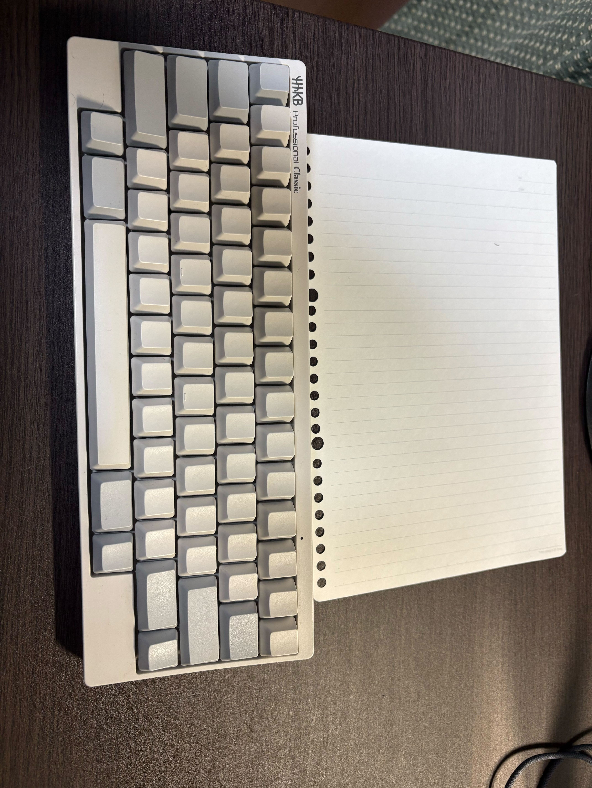
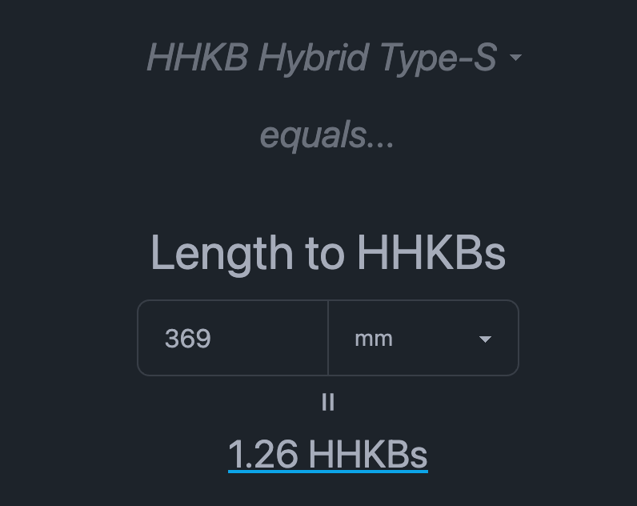
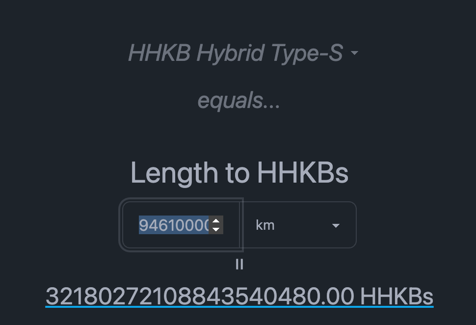
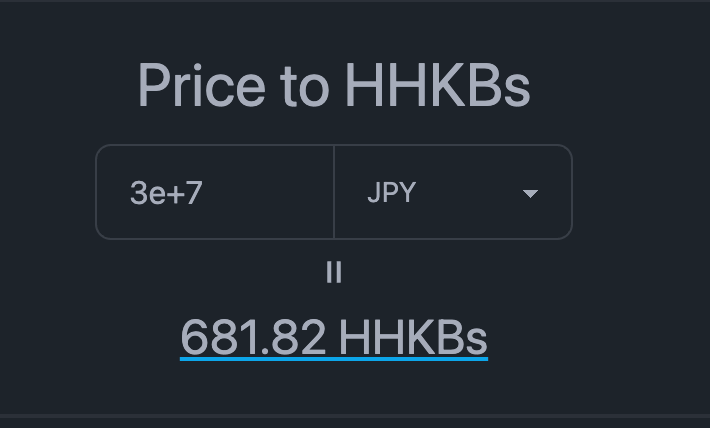

> [!NOTE]
> この記事は[Vim 駅伝](https://vim-jp.org/ekiden/)の 10/21 の記事です。

# TL;DR

https://hhkb-equals.pages.dev/

# はじめに

皆さんは HHKB 使っていますか？
僕は使っていません！

... 完

# 原器としての HHKB

HHKB は vim-jp では原器としてよく使われています。

https://blog.tomoya.dev/posts/prototype-of-the-hhkb

> 現在国際的に使用されているガジェット評価の単位系であり、
> 長さ、重さ、面積、体積、金額の5つをHHKB基準とした物理量として構成し、
> またそれの乗法、除法で導かれる組み立て単位とその他の誘導単位を使って表現する。

ですが、いちいちHHKBのスペックを調べるのが面倒(すう〜）なので、今回簡易的に計算できるツールを作りました。

https://hhkb-equals.pages.dev/

# HHKB のスペック

ここで、HHKB の specをおさらいしておきましょう。

```json
{
	"HHKB Hybrid Type-S": {
		"width": 294,
		"depth": 120,
		"height": 40,
		"weight": 540,
		"priceJpy": 36850
	},
	"HHKB Studio": {
		"width": 308,
		"depth": 132,
		"height": 41,
		"weight": 840,
		"priceJpy": 44000
	}
}
```

# いくつか比べてみよう！

せっかくなので比べてみます！

<!-- 現在は面積と体積は実装していないので、そちらは手計算しています -->

## ミジンコ

なんで初っ端からミジンコなんだよ、ありすえさんが悪い。

ミジンコは約0.5mmです。

https://www2.nhk.or.jp/school/watch/clip/?das_id=D0005300599_00000

なので換算すると

| HHKB Hybrid Type-S | HHKB Studio   |
| ------------------ | ------------- |
| 1.70e-3 HHKBs      | 1.62e-3 HHKBs |

らしいです。小さいですね〜〜〜〜

## コピー用紙

### A4 コピー用紙のサイズは 210mm x 297mm です。

https://raksul.com/magazine/column/a4size/

なので、長辺をHHKBに換算すると

| HHKB Hybrid Type-S | HHKB Studio |
| ------------------ | ----------- |
| 1.01 HHKBs         | 0.96 HHKBs  |

らしいですね〜

### B5 でも調べてみよう


_提供 [haruki7049](https://github.com/haruki7049)。これはclassicだが_

B5の大きさは、182mm x 257mmですね。

https://raksul.com/magazine/column/b5size/

なので、長辺をHHKBに換算すると

| HHKB Hybrid Type-S | HHKB Studio |
| ------------------ | ----------- |
| 0.87 HHKBs         | 0.83 HHKBs  |

## Realforce と比べてみる

REALFORCE R2のスペックは以下の通りです

```json
{
	"REALFORCE R2": {
		"width": 369,
		"depth": 142,
		"height": 30,
		"weight": 1100,
		"priceJpy": 31350
	}
}
```

https://www.pfu.ricoh.com/rfkeyboard/spec/



幅

| HHKB Hybrid Type-S | HHKB Studio |
| ------------------ | ----------- |
| 1.26 HHKBs         | 1.20 HHKBs  |

重さ
| HHKB Hybrid Type-S | HHKB Studio |
| --- | --- |
| 2.04 HHKBs | 1.31 HHKBs |

価格
| HHKB Hybrid Type-S | HHKB Studio |
| --- | --- |
| 0.85 HHKBs | 0.71 HHKBs |

ガジェットと比べるとわかりやすいですね〜〜
いや〜HHKBはいい指標だなぁ〜〜

## 自分と比べる

自分は

- 身長 173 cm
- 体重 65 kg

なので、

身長は

| HHKB Hybrid Type-S | HHKB Studio |
| ------------------ | ----------- |
| 5.88 HHKBs         | 5.62 HHKBs  |

体重は


| HHKB Hybrid Type-S | HHKB Studio |
| ------------------ | ----------- |
| 120.37 HHKBs       | 77.38 HHKBs |

体重の方が多いですね！

金額で換算すると

| HHKB Hybrid Type-S | HHKB Studio |
| ------------------ | ----------- |
| 4435634.5 JPY      | 3404720 JPY |

340 ~ 450万円で僕の体重になるんですね〜〜

## スカイツリー

スカイツリーの高さは634mです。

これを換算すると

| HHKB Hybrid Type-S | HHKB Studio   |
| ------------------ | ------------- |
| 2156.46 HHKBs      | 2058.44 HHKBs |

大体 **2156 HHKB** くらいですね!

## 地球

地球の直径は約12742kmです。

| HHKB Hybrid Type-S | HHKB Studio   |
| ------------------ | ------------- |
| 4.33e+6 HHKBs      | 4.14e+6 HHKBs |

そして重さは


| HHKB Hybrid Type-S | HHKB Studio    |
| ------------------ | -------------- |
| 1.11e+22 HHKBs     | 7.14e+21 HHKBs |

とのことです！

ちなみに重さベースでお値段に換算すると

| HHKB Hybrid Type-S | HHKB Studio    |
| ------------------ | -------------- |
| 4.05e+26 HHKBs     | 3.14e+26 HHKBs |

ですね!
5.0e+15(5000兆)でも買えないので、地球は買えません！

## 天の川銀河

天の川銀河の直径は約10万5700光年です。

さて、まずは1光年が何メートルか計算しましょう。


なるほど（全然わからん）



なるほど、**1光年は 32180272108843540480 HHKB** らしいです！

10万5700光年は `1.0000277e+21` メートルなので

| HHKB Hybrid Type-S | HHKB Studio    |
| ------------------ | -------------- |
| 3.40e+24 HHKBs     | 3.25e+24 HHKBs |

らしいです。
これだけHHKBを買えるくらい、稼ぎたいものですね！

## 老後資金

さて皆さん、現実をみましょう。



老後資金は、3000万円が必要だと言われています。

これをHHKBに換算すると

| HHKB Hybrid Type-S | HHKB Studio  |
| ------------------ | ------------ |
| 814.11 HHKBs       | 681.82 HHKBs |

おお〜いっぱいありますね。
700 ~ 800のHHKBに囲まれて老後を過ごすのも悪くないかもしれませんね！

## 5000兆円

最後に、夢をみましょう。
5000兆円あったらいくつHHKBが買えるのでしょうか？

| HHKB Hybrid Type-S | HHKB Studio    |
| ------------------ | -------------- |
| 1.36e+11 HHKBs     | 1.14e+11 HHKBs |
| 1360億 HHKBs       | 1140億 HHKBs   |

なんと、Studio が 1140億 HHKBも買えるんですね！
富豪的プログラミング！！！！

# おわりに

皆さんも身の回りのものをHHKBで換算してみてください！
