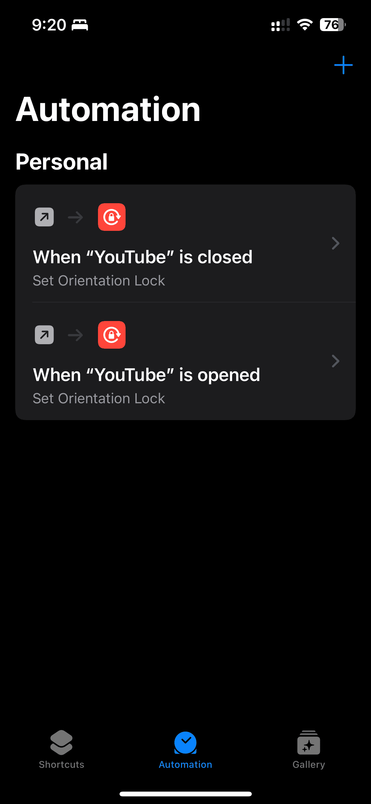
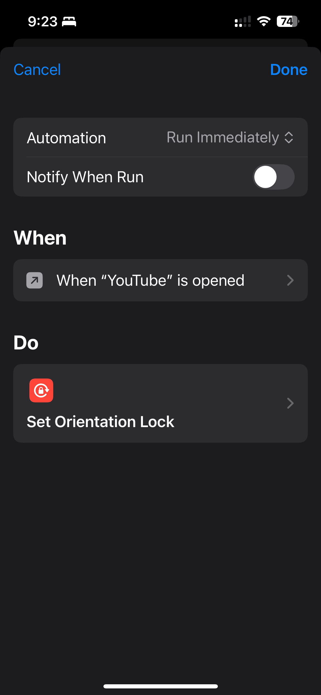

I watch Youtube and Twitch on my iPhone a lot. One of my friend {@yuki-yano} introduced an amazing shortcut in {vim-jp} Slack about a year ago. Now, I can't live without it.

When you configure this shortcut, the rotation lock is disabled when you open the Youtube app and enabled when you close it. I configure it for Twitch app as well.

{.w-1/2 .mx-auto .block .my-4}

Enjoy!
